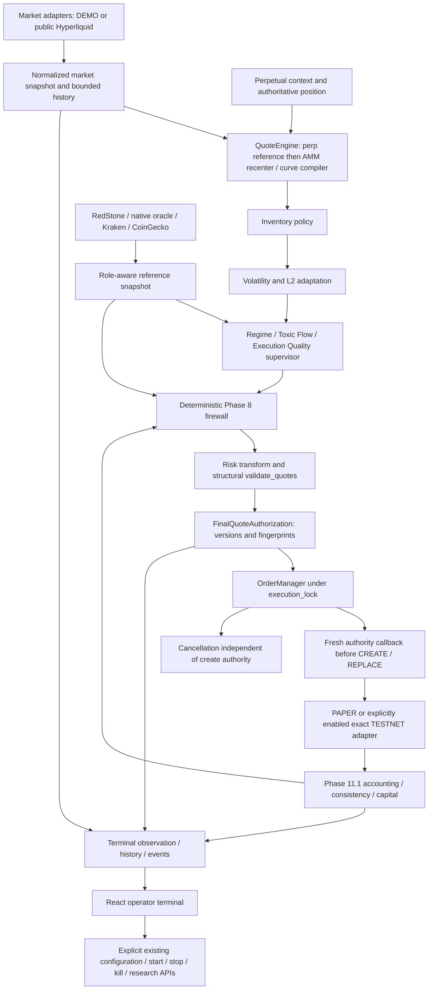

# HyperAMM Audit Report 1.0

## Executive Summary

### Post-remediation status — 2026-10-08 (America/Los_Angeles)

This is a status update to Audit 1.0, not a replacement audit. Current GitHub
`main` was independently verified through the GitHub integration at
`5f3336999d62d9241bb8591b807f48a634f9812f` (merged PR #32); the reviewed local
checkout matches that commit. The local `origin/main` ref was stale and direct
Git fetch was proxy-blocked, so it was not used as the current-state baseline.
Merged PR metadata, implementation commits, current source and regression-test
assertions were reviewed for all A1-001–A1-027.

**Current verdict:** substantial code remediation has landed. The original
transmission, material-market, execution-history and duplicate-slot defects are
remediated in code; SDK reconnect/teardown now have deterministic regression
evidence. Live transport, external-provider and signed venue acceptance remain
separate gates. Supported deployment remains local, single-operator and
single-worker. Optional Redis distributes observations and coordinates ephemeral
resources; it supplies no financial authority or durable recovery.

Current dispositions: **15 🟢 CLOSED, 7 🟡 PARTIALLY CLOSED, 5 🔵 DOCUMENTED /
ACKNOWLEDGED; no finding classified wholly 🔴 OPEN.** Partial items are A1-001,
A1-003, A1-004, A1-006 (code closed, live/signed acceptance pending), A1-009
(local boundary implemented, remote security absent), A1-016 (numerical/sampling
hardening implemented, empirical calibration pending), and A1-017 (compatibility
review documented, NumPy removal deliberately deferred). A1-013 and A1-024–A1-027
are acknowledged policies/design boundaries, not invented runtime fixes.

**Reading the historical record:** unless explicitly labeled post-remediation or
current disposition, the original narrative, severity, finding table,
observations, tests/missing tests, recommendations, priorities, verdict and
48 answers below describe the **2026-10-07 original audit baseline**. Their
present-tense wording is historical evidence, not the current action list.
Each finding's dated status block, section 23 and the dated section 24 update
supersede that wording for current status. Original acceptance counts and dates
remain unchanged. This Markdown-only review did not rerun application tests or
perform live provider, signed venue or real Redis acceptance.

### Original Audit 1.0 executive summary (2026-10-07)

**Verdict:** the Phase 1–12 implementation roadmap exists as an integrated research and operator system. It is not yet production-oriented trading infrastructure. Local deterministic correctness is substantially stronger than live acceptance, restart durability, operational security, and transmission-level authority. Immediate hardening is warranted before serious TESTNET reliance; remediation should follow finding IDs across phases rather than become a new feature phase.

| Audit fact | Verified result |
|---|---|
| Repository | `btorressz/hyperamm` |
| Audit date | 2026-10-07; acceptance timestamps below are UTC |
| Exact starting current main | `85a42ee96bc0ba69b7c4278c32d5e497cf827887` |
| Prompt's historical SHA | `c1d114a27f816d339fcbe8d36b705321d6e95392`; not the current baseline |
| Audit branch / intended change | `audit-report-1-0` / this root report only |
| Backend | Python 3.12.14; **546 passed, 0 failed, 1 warning, 14.40s** |
| Frontend | Typecheck and production build exit 0; Vite 7.3.6, 139 modules, 2.21s |
| Local application | DEMO/PAPER only; 28 GETs and 6 POSTs succeeded, expected rejection checks passed |
| Terminal | Five valid WebSocket frames; two-client sequence check; 12 pages rendered; five viewport widths checked |
| External providers | Public attempts blocked by configured environment proxy; authenticated RedStone Live not attempted |
| Findings | **1 🔴 HIGH, 6 🟠 HIGH-MEDIUM, 16 🟡 MEDIUM/HARDENING, 4 🔵 INFORMATIONAL** |
| Major verified areas | **9 🟢**, bounded by the qualifications below |
| Scope restrictions | No production fixes, manifest/lockfile changes, new dependencies, GitHub Actions, signed TESTNET trades, or mainnet additions |

The highest-priority confirmed defect is SDK normalization after authorization: two authorized opposite-side prices can both become the same wire price, and the final guard does not bind that wire request. Additional material findings concern equal-sequence L2 changes, missing actual public-SDK reconnection, missing SDK WebSocket teardown, unbounded execution history, and duplicate resting-slot reconciliation/exposure. Terminal defects concern provenance, contract validation, observation costs, and read side effects; they do not establish browser signing authority.

### Method and evidence limits

The audit inspected source, tests, manifests, documentation, recent merged PRs, API contracts, installed SDK behavior, safe local execution, and targeted synthetic counterexamples. Code is the source of truth; a passing test is supporting evidence, not proof of all behaviors. No coverage percentage, long-duration soak, multi-process deployment, statistical profitability validation, external rate-limit exercise, signed venue reconciliation, or formal security proof was performed. Mockup comparison uses the supplied textual concept: an original image was not available for pixel comparison.

Current main was independently verified and fetched. The starting checkout was clean. Recent merged work reviewed includes PRs #9 (agents), #10 (simulation), #11 (research isolation), #12 (accounting), #13 (accounting hardening), and #14 (terminal). Phase 12 merged at `634b3de296289d55c75b765810fd05c43fe8720b`; subsequent main commits updated documentation, culminating in the baseline above. Acceptance installed existing declared dependencies in ignored environments, without changing repository dependency content. Scratch probes and screenshots are not part of this PR.

### Nine major verified strengths

| ID | Area | Evidence and exact scope |
|---|---|---|
| G1 🟢 | Decimal virtual AMM and compiler | `amm/constant_product.py`, `virtual_reserves.py`, `liquidity_curve.py`, `discretizer.py`; positive reserve checks, invariant-preserving recentering, per-side allocation, side-aware rounding; AMM/integration tests. This excludes later SDK rounding. |
| G2 🟢 | Inventory and downstream hierarchy | `strategy/inventory.py`, `quote_engine.py`; bounded skew and hard-limit increasing-side suppression. Later agents/firewall cannot recreate removed quotes. |
| G3 🟢 | Conservative supervisory transforms | `agents/supervisor.py`; max widening/min sizes/min levels, explicit no price aggression or size increase versus each upstream quote; Phase 9 tests/static constraints. Error recovery is separately qualified. |
| G4 🟢 | Role-aware reference consensus | `references/consensus.py` and Phase 8/8.2 tests; CoinGecko is tertiary, native mark/mid are not extra core votes, RedStone transport fallback is one provider and degrades confidence. This does not prove provider independence or live transport. |
| G5 🟢 | Official execution locking and fail-closed cancellation | `runtime.py`, `execution/order_manager.py`, `hyperliquid.py`; shared lock, pre-create checks, kill latch, UNKNOWN handling, unconfirmed cancellation prevents replacements. Wire-request binding and duplicate slots remain exceptions. |
| G6 🟢 | Isolated bounded research worker | `simulation/executor.py`, engine/config/API; fresh PAPER state, allowlists, one busy slot, no live provider startup/signing, cancellation does not prematurely release the worker. |
| G7 🟢 | Shared average-cost accounting and atomic ledger | `accounting/pnl.py`, `service.py`, `ledger.py`; runtime/simulation reuse; economic idempotency, atomic fill+fee append, capacity halt, chain verification. Research assumptions and in-memory retention apply. |
| G8 🟢 | Phase 11.1 peak/consistency/capital guards | Accounting/runtime/authorization tests; fee-adjusted committed high-water tracking, fill-ledger consistency failures block create, accounting fingerprint/version binding and reservation checks. |
| G9 🟢 | Separate terminal observation package and bounded histories | `terminal/`, Phase 12 static/history/WebSocket tests; no signing/execution imports in the package, bounded observations/events, backend process/session identities. Runtime getters can still mutate domain state. |

## 1. System Architecture

> **Post-remediation note (2026-10-08):** PR #16 now normalizes venue economics before final validation/authorization and checks concrete request membership plus SDK wire round-trip equality (A1-001). The original diagram and boundary statement below describe the pre-remediation path.

### Actual authority and data flow

Primary wiring is `backend/app/runtime.py`: `refresh_once`, `_execution_authority`, `_invalidate_locked`, market/perp callbacks, lifecycle methods and `terminal_state`. Perp policy runs **before** virtual reserve recentering, not after market adaptation; some conceptual diagrams/UI stage ordering obscure this. Candidate accounting reservations enter risk evaluation; the final risk-transformed ladder is structurally validated before authorization. Final reservations and fresh accounting are rechecked on execution. Cancellation remains available when quotes are unauthorized.

Market and perpetual services normalize inputs; references supervise source integrity; strategy constructs proposals; agents can only constrain proposals; Phase 8 controls deterministic risk; accounting supplies position/equity/consistency/capital; the authorization envelope binds the current ladder; execution reconciles and transmits. The terminal observes and invokes explicit control APIs. Simulation uses the same domain implementations in fresh offline state, without sharing the live runtime or providers.

**Important boundary:** `_execution_authority` binds `self.quotes` and domain versions, not a concrete SDK-normalized `OrderRequest`. That distinction prevents a blanket claim of end-to-end transmission authorization (A1-001). Internal adapter APIs can also be constructed without callbacks; no generic public order-submission route was found.

## 2. Original Roadmap vs Current Implementation

> **Post-remediation note (2026-10-08):** The implementation/review table below is the original phase assessment. PR #26 corrected obsolete current documentation; phases 1–12 are implemented, with local acceptance distinct from live/provider review. No new phase is introduced here.

One primary classification per numbered phase; completeness of code is separate from acceptance status.

| Phase | Original intent | Classification | Current implementation, change and judgment | Documentation / review |
|---|---|---|---|---|
| 1 | Market data and execution foundation | EXACT | Normalized L2/BBO, explicit DEMO, deterministic PAPER, guarded TESTNET; intended basic foundation exists. Real SDK reconnect and teardown are weaker than claims. | COMPLETE is historical local acceptance, not live transport certification. |
| 2 | Virtual constant-product AMM | EXACT | Decimal x*y=k, marginal y/x, swaps, virtual reserve recentering. No custody or exchange-owned pool; this is quote construction. | Math docs substantially accurate. |
| 3 | Curve-to-CLOB compiler and multiple contemplated curve modes | ADAPTED | Reserve-delta weighted ladders with per-side fixed budgets and floors. Only CONSTANT_PRODUCT and CONCENTRATED exist; early GEOMETRIC/ADAPTIVE modes are absent. Downstream adaptive policy replaces much of the adaptive intention, not a hidden third curve enum. | Explicitly reconcile retired mode ideas in roadmap; do not label all absent enums bugs. |
| 4 | Concentrated liquidity | ADAPTED | Bounded distance profile multiplier with nonzero outer tail, normalized into CLOB quantities; not Uniswap v3 range positions. Simpler and appropriate for a virtual ladder, but terminology needs care. | Current math docs explain profile; conceptual equivalence to v3 would be misleading. |
| 5 | Inventory-aware AMM | EXACT | Target-relative skew, reservation shift, variable size skew, hard-limit increasing-side suppression; authoritative PAPER accounting/TESTNET position input. | Local complete; defaults and absolute Phase 8 limits have distinct meanings. |
| 6 | Volatility-adaptive AMM | ADAPTED | Bounded history, per-observation RMS log returns and top-N base-size imbalance drive widen/reduce policy. This is an adaptation layer rather than another curve model. | IN REVIEW justified for findings/calibration; old claim that Python/frontend commands remain unrun is stale. |
| 7 | Perpetual vAMM | EXPANDED | Native mark/oracle/funding/OI context, weighted reference, capped funding shift, position/liquidation evidence and version guards. No perpetual clearinghouse is built. | IN REVIEW justified: live delivery/venue position freshness not accepted. |
| 8 | Oracle protection layer | EXPANDED | Multi-source provenance, quorum, degradation, deviations, exposure/liquidation/loss, posture/hysteresis, final authorization. Stronger deterministic architecture than one oracle check. | External acceptance still outstanding; IN REVIEW remains honest. |
| 9 | Supervisory agents including risk/optimization concepts | REPLACED | Three deterministic heuristic agents plus conservative supervisor. Original Risk Agent becomes Phase 8 firewall; Optimization Agent becomes isolated Phase 10 research. This improves authority boundaries rather than omitting necessary safety. | IMPLEMENTED / IN REVIEW is appropriate; no learned autonomous execution is claimed. |
| 10 | Simulation / optimizer | EXPANDED | Full domain-stack deterministic replay and bounded grid optimization, fingerprints, isolated busy-slot executor; no automatic best-config deployment. | Local acceptance passed, review/research limitations remain. |
| 11 | AMM market-making vault | PARTIAL | Research settled capital, average-cost ledger, fees/funding, equity, peaks, reservation and consistency authority. Custody, investor shares/NAV, deposits/withdrawals are deliberately OUT OF SCOPE. | Calling it research accounting is accurate; calling it a pooled live vault would not be. |
| 12 | Institutional terminal concept | ADAPTED | Twelve real pages, explicit source/mode/health, observational contracts, bounded charts/events, real controls and research views; illustrative unsupported economics removed. | IMPLEMENTED / IN REVIEW; report identifies presentation/schema/observation hardening. |

Subphases 4.1, 8.2, 10.1 and 11.1 are execution, reference transport, research-isolation and accounting-integrity hardening respectively; they materially improve the design. They do not convert fixture acceptance into live acceptance. No Phase 13 has begun or is justified before closing the present authority and operational gaps.

The original assumptions that all curve variants were necessary, a generic Risk Agent should own risk, an Optimization Agent should run beside execution, and a vault necessarily means custody were simplified or replaced appropriately. Reference provenance, deterministic authority, simulation isolation and accounting became substantially more sophisticated. The main documentation problem is mixing historical acceptance statements with current status (A1-018).

## 3. Phase-by-Phase Review

> **Post-remediation note (2026-10-08):** The historical gaps below now have per-finding dispositions in section 22. PRs #16–#24 and #26–#29 remediate the reviewed code defects; A1-013 retains a documented optional-agent policy and A1-017 retains NumPy by explicit decision. Live/calibration gates are not closed by these merges.

### Phase 1 — Market Data + Execution Foundation

`market_data/service.py`, `hyperliquid.py`, `models.py`, `execution/paper.py`, `execution/hyperliquid.py` and `order_manager.py` provide snapshot acceptance, L2/BBO extraction, freshness, order/fill state and reconciliation. Negative/invalid books fail closed; LIVE exchange time cannot move backward. Equal sequence/equal exchange timestamp is still accepted by the market service while history deduplicates it (A1-002). The installed official SDK is not a proven reconnecting transport (A1-003); unsubscribe is not SDK thread shutdown (A1-004).

PAPER uses deterministic crossing at limit price, no queue priority, partial-depth model, latency or hidden liquidity. This is an explicit simulation assumption, not exchange validation. TESTNET requires opt-in, configured key and exact TESTNET endpoint; the public market URL can be mainnet without being a trading endpoint. Positions/fills/accounting are honest about partial TESTNET evidence. Old order/fill containers are unbounded (A1-005).

### Phase 2 — Virtual Constant-Product AMM

`amm/constant_product.py` implements positive finite reserves, k=x*y, y/x marginal price and exact Decimal swap deltas. `virtual_reserves.py` uses x=sqrt(k/reference), y=sqrt(k*reference); recentering preserves k within the configured relative Decimal tolerance (1e-18). This is a virtual quoting state, not balances changing through real on-chain swaps. Decimal context rounding exists; no formal interval error bound or exhaustive extreme-scale proof was established. Tests cover representative swaps, invalid values, invariant and recentering behavior.

### Phase 3 — AMM Curve → CLOB Compiler

`liquidity_curve.py` samples incremental absolute reserve movements, validates ordering and normalizes per side. `discretizer.py` rounds BID down, ASK up and sizes down; a rounded-up base-order floor is budgeted before distributing variable liquidity. `total_liquidity` is **per-side base quantity**, not a USD TVL promise. Equal budget/floor can yield uniform quantities intentionally. At fixed normalized budget, scaling k cancels profile shape: increasing virtual k does not automatically increase quoted capital (A1-024).

Tick normalization can collapse levels onto the same price; level identity remains side/index, not unique tick. This is not necessarily invalid, but exchange aggregation and duplicate slot handling need explicit tests. There are no reachable GEOMETRIC or ADAPTIVE enum modes. Structural checks do not repair later SDK normalization (A1-001).

### Phase 4 — Concentrated Liquidity

`amm/concentrated.py` applies a bounded profile, conceptually `1/(1+c*z²)` with clamped normalized distance. Inner concentration raises relative weight; outside the upper distance the clamped multiplier remains positive, so liquidity is not restricted to a strict range. Re-normalization preserves budgets and floor semantics. This is a concentration profile for a CLOB, not tick-indexed range liquidity, LP ownership or v3 fee accounting. Current implementation is defensible when labeled precisely.

### Phase 4.1 — Execution Acceptance & Hardening

The shared execution lock, quote validation, replacement ordering, UNKNOWN registration and cancellation confirmation materially improve the original foundation. Kill and config transitions clear stale ladders; cancellation failure retains a halt latch. An external request already in flight cannot be unsent; cancellation shielding waits for resolution rather than falsely pretending nothing happened. Tests support these semantics locally, but wire rounding, duplicate resting slots and transport teardown remain unresolved.

### Phase 5 — Inventory-Aware Quoting

`strategy/inventory.py` clamps `(position-target)/soft_limit` to [-1,1], shifts reservation away from excess inventory, scales bid/ask variable liquidity within bounds, and suppresses the inventory-increasing side at the target-relative hard limit. Inventory-reducing side size can grow relative to a neutral policy **by design**, before the conservative agent layer. That is not an agent risk increase.

PAPER position comes from authoritative shared accounting; TESTNET uses venue position evidence and fails closed on unknown/stale errors. Absolute projected-position limits in Phase 8 are separate from Phase 5 target-relative limits; nonzero targets need explicit operator calibration. Downstream transformations preserve hard-suppressed sides. Inventory versions are checked before sends.

### Phase 6 — Volatility + L2 Book Imbalance

`market_data/history.py` bounds unique price samples and rejects duplicate sequence IDs. `strategy/market_adaptation.py` uses RMS log returns, not demeaned sample variance or annualized volatility. It crosses Decimal→float for logarithms and square root, then Decimal(str(...)); this score influences quote authority. Top-N imbalance is `(bid_base_size-ask_base_size)/(bid_base_size+ask_base_size)`, not notional liquidity. Missing sides/invalid total liquidity are not fabricated as balanced books.

Warmup is explicit; factors widen spreads and reduce variable liquidity without consuming the floor or restoring removed sides. Sampling is event/count based rather than time-normalized, so burst/sparse feeds and irregular intervals change score interpretation (A1-016). The equal-sequence acceptance gap also affects imbalance provenance (A1-002). Local commands now pass, but live calibration/review remain open.

### Phase 7 — Perpetual Context

`market_data/perp_context.py`, `strategy/perp_policy.py` and runtime consume native mark/oracle/funding/OI, normalized basis and position/liquidation evidence. Defaults weight mark .25, oracle .25 and market .50; required-source absence fails closed rather than quietly reweighting. Positive funding shifts the quoting reference down, with bounded policy and a total shift cap (default 50bps), **before AMM recentering**. Funding price bias is distinct from accounting funding cash flows.

Material context changes advance version; identical observations can refresh observed time without advancing semantic version. Native public payloads lack a certified source timestamp, so local receive time is used. This bounds local observation age, not upstream price age. Long liquidation distance is `(mark-liq)/mark`; short is `(liq-mark)/mark`, and wrong-side evidence is not a safe positive distance. No signed/live user-state acceptance occurred.

### Phase 8 / 8.2 — References and Deterministic Risk

Provider normalization, finite positive prices, freshness, transport provenance, conflict/outlier handling and role-aware votes are inspected in `references/`. Public HTTP fallback is one RedStone identity with degraded confidence, not a second oracle vote. Phase 8.2 adds robust HTTP parsing, timestamps, classifications and redaction tests. Generic evidence deadbands still refresh timestamp while retaining old price (A1-008), and local receive times do not certify native source freshness.

`risk/firewall.py` evaluates reference confidence, market/mark/oracle deviations, projected inventory, liquidation distance, session loss/drawdown and uncertain order state; postures NORMAL/WIDEN/REDUCE/HALT tighten immediately and recover after consecutive evaluations with hysteresis. Recovery confirmations are evaluations, not necessarily distinct external evidence or elapsed-time intervals. Disabling the risk config skips its candidate policy, not only oracle checks; independent structural/capital controls still exist. Treat this switch as an operator authority decision.

Exposure uses per-slot maxima for desired/resting replacement risk, appropriately avoiding automatic double-counting of a cancel-before-create replacement. Duplicate existing orders in one slot violate that assumption and are undercounted (A1-006). Authorization version/fingerprint checks are broad, but not fully transmission-bound (A1-001/A1-002).

### Phase 9 — Supervisory Agents

Regime, Toxic-Flow, Execution-Quality and AgentSupervisor exist; no autonomous signer, risk override or online optimizer exists. Composition is conservative relative to the upstream candidate. Agent ERROR defaults are neutral rather than persistent restrictive fallbacks (A1-013). Domain algorithms, telemetry horizons, maturity and quality labels need the research qualifications in Section 4.

### Phase 10 / 10.1 — Deterministic Simulation and Optimization

Fresh isolated PAPER runs reuse the real domain stack; bounded grids and explicit allowlists exclude execution mode, signer/provider credentials and safety controls. Busy-slot behavior survives request cancellation until work actually ends. Deterministic ranking and engine-version fingerprints are meaningful but not a full code/dependency provenance record. Training and validation scenario labels are not disjoint by enforcement (A1-015); deterministic catalog overlap is not independent holdout evidence.

### Phase 11 / 11.1 — Research Accounting

One shared Decimal average-cost engine handles long/short add, reduce, close and reverse. Immutable trade/fee/funding/mark records, economic idempotency, chain integrity and atomic capacity checks are substantial strengths. Phase 11.1 observes committed fee-adjusted peaks and halts divergent execution/accounting states. PAPER capital is a full-notional research reservation model, not exchange margin. TESTNET fields unavailable from current evidence remain null/partial, not reconstructed fictional cash or fees.

### Phase 12 — Operator Terminal

Twelve pages are implemented with coherent dark styling, source/mode/health, stage attribution, charts, ledger and research tools. The terminal package does not sign or transform quotes. Its runtime observation path nevertheless observes fills and some GET helpers mark accounting/refresh strategy state (A1-010/A1-011). Fresh transport can display retained stale perp/reference health (A1-022). Contract/type and lineage display defects do not themselves let a browser trade outside backend controls.

## 4. Supervisory Agent Deep Audit

> **Post-remediation note (2026-10-08):** PR #19 freezes matured markouts; PR #22 binds fill-time consensus provenance, removes KEEP dilution of churn and requires mature evidence for GOOD. Optional ERROR neutrality is explicitly documented/tested, not replaced by a required-agent safety mode. PR #24 hardens the shared count-based estimator (A1-007/A1-013/A1-014/A1-016).

### Authority boundary and composition

Files inspected: `agents/config.py`, `models.py`, `evidence.py`, `regime.py`, `toxic_flow.py`, `execution_quality.py`, `supervisor.py`; Phase 9 runtime/static tests and Phase 10 integration. No agent imports signer/network execution or credentials. Supervisor combines max spread, min bid/ask factors and minimum optional level caps, clamps within code-owned configuration and transforms existing quotes only. BID may not become higher, ASK may not become lower, size may not increase and missing upstream levels/sides are not restored. Risk runs after supervision on actual post-agent candidates.

A supervisor ERROR has neutral factors and zero confidence; losing a previously cautious output can permit a less restrictive next candidate. That preserves the per-evaluation invariant while relaxing across time (A1-013). Agents cannot change Phase 8 config, clear manual kill or sign orders. Their numeric inputs can be misleading even when their transform is conservative.

### Regime Agent

Uses existing Phase 6 volatility, bounded history momentum, reference displacement and warmup evidence; it does not independently duplicate the volatility formula. Priority is dislocation, high volatility, trend, quiet, normal. Momentum is endpoint return over a sample window, not elapsed-time momentum. Confidence is heuristic sample/score scaling, not a calibrated probability of a future market state. OI availability in context does not establish an implemented independent OI forecasting model. Reuse of Phase 6 is appropriate; count-based calibration should be documented (A1-016).

### Toxic-Flow Agent

For a BID fill, markout is `+(future_mid-fill_price)/fill_price*10000`; ASK reverses the sign. Only observations at/after fill+horizon and available by evaluation time can mature a markout. Pending/no-fill data remains explicitly insufficient rather than statistically favorable. Fill IDs and windows are bounded. However, matured observations are recomputed from the currently retained history: eviction changes the selected horizon point for the same fill (A1-007). This weakens reproducibility and economic meaning of aggregate toxicity.

The signal is descriptive adverse selection under deterministic PAPER fills, not a statistically estimated toxic-flow probability. It lacks queue/latency/fee conditioning, confidence intervals and independent out-of-sample calibration. Mean markout can hide directional tails and sparse samples; no profitability claim follows from its score.

### Execution-Quality Agent

Spread capture uses BID `(reference-fill)/reference*10000`, ASK `(fill-reference)/reference*10000`; churn uses `(replace+cancel)/(keep+create+replace+cancel)`. Counts of rejection/UNKNOWN tighten the output. PAPER fill capture can use the previous runtime reference, whereas simulation resting-fill conditioning uses frame midpoint; this is not identical economic conditioning. Frequent KEEP evaluations improve the churn ratio without improving venue outcomes. GOOD can be reached with positive capture while markouts are still unavailable (A1-014). TESTNET fill limitations are explicit, and absent real fills do not prove excellent venue execution.

### Versions and fingerprints

Agent decision fingerprints bind material recommendation, health/confidence, factors, level cap, reasons/state/simulation label. Evidence version hashes domain versions; they are not a hash of every raw telemetry value, full config, timestamp or complete evidence bundle. Agent timestamps are excluded to avoid every-observation churn; unchanged advice can retain semantic version despite changed raw observations. Separate final market/inventory/perp/reference/risk/accounting guards provide additional binding, but equal-sequence L2 is an exception. A short evidence hash is provenance, not a security capability. Document semantic versus evidence identity (A1-027).

Separating deterministic risk and offline optimization from agents is architecturally sound. Keep optional research libraries and heuristic confidence outside direct execution authority.

## 5. Reference / Provider / Risk Audit

> **Post-remediation note (2026-10-08):** PR #19 preserves the exact retained price/source-time pair under deadband updates (A1-008). PR #28 recomputes observational source freshness (A1-022). The external-provider acceptance table below remains historical; no new successful provider acceptance is claimed.

### Provider roles and consensus

| Source | Transport / role | Freshness / truth boundary |
|---|---|---|
| RedStone Live | Authenticated WebSocket, primary core external oracle | Normalizes price/package/source metadata; configured credentials required; not accepted live here. |
| RedStone public HTTP | Public fallback under the same provider identity | Strict HTTP parsing/age checks; fallback lowers trust, never creates a second vote. |
| Hyperliquid native oracle | Existing native perp context, core native reference | Local observed timestamp where upstream lacks source time; native mark/mid are diagnostics, not independent core votes. |
| Kraken | Public WebSocket v2 BBO, core exchange reference | BBO midpoint and feed timestamps; real proxy-blocked transport unaccepted. |
| CoinGecko | Public aggregate HTTP, tertiary confirmation | Not core quorum; longer freshness allowance, deadband; aggregate upstream independence is not certified. |

Consensus computes an initial median/outlier screen, removes sources above the configured large-deviation threshold (defaults include 75bps), then evaluates core agreement (default 30bps). At least two core sources are required. RedStone+Kraken can be VERIFIED; native combinations/fallback limitations can yield DEGRADED. CoinGecko can affect the **initial outlier screen**, even though it cannot add a core vote. Deterministic median uses Decimal with even-size average. This is role diversity, not proof that underlying oracle constituents are statistically or institutionally independent.

Provider-specific age budgets differ (e.g. short streaming budgets, longer HTTP/CoinGecko budgets); there is no measured SLA calibration in this audit. Generic evidence allows a small future-time tolerance while strict HTTP rejects future timestamps: that distinction deserves explicit contract documentation. Deadband publishes old price with new timestamp (A1-008). Native context age measures receive age. Source-freshness caveats must not become terminal HEALTHY evidence after source failure (A1-022).

### Failover, protocol and security

RedStone Live subscribes with operation/items/feedId/type/dataServiceId and normalizes type, data service, package identity, timestamp and value. Permanent topic-limit/auth failures are classified separately from retryable transport errors; key/header redaction is tested. `websockets` 15 `additional_headers` compatibility is reflected in code. Public fallback is explicit, not silent promotion. None of those inspected protocol paths is a substitute for a real successful subscription, reconnect or rate-limit acceptance.

### Real provider acceptance

| Provider | Attempt | Result | Interpretation |
|---|---|---|---|
| RedStone Live | No authenticated endpoint/key configured; no secret requested | **NOT ATTEMPTED** | Live protocol/auth/subscription remains unaccepted. |
| RedStone public HTTP | Safe public GET through configured proxy | **BLOCKED BY ENVIRONMENT**, `httpx.ProxyError` | No observation received; not an established provider bug or rate limit. |
| CoinGecko | Safe public GET through configured proxy | **BLOCKED BY ENVIRONMENT**, `ProxyError` | No schema/freshness/rate-limit acceptance. |
| Hyperliquid public market info | Unsigned public l2Book request through proxy | **BLOCKED BY ENVIRONMENT**, `ProxyError` | No real book/activeAssetCtx/reconnect acceptance. |
| Kraken WebSocket | Public connection through configured proxy | **BLOCKED BY ENVIRONMENT**, `InvalidProxyStatus` / proxy rejection | No subscription/message/reconnect acceptance. |

No egress bypass, authenticated secret output, signed TESTNET order or mainnet transmission was attempted. Do not mark these checks PASSED. Existing Phase 8 external acceptance remains outstanding; safe external acceptance from an authorized environment is a prerequisite for confidence in live operation.

## 6. Execution & Reconciliation Audit

> **Post-remediation note (2026-10-08):** PR #16 closes the normalized-request binding defect; PR #17 closes changed-material identity in code and implements supervised SDK recovery/teardown; PR #18 bounds closed execution views and counts/reconciles every active duplicate order (A1-001–A1-006). Signed venue and real transport acceptance remain pending; restart durability is still absent.

`execution/quote_reconciler.py` compares desired/resting side-level slots and chooses KEEP/CANCEL/CREATE/REPLACE. Replacements cancel first; no replacement is sent after unconfirmed cancel. Unknown/in-flight orders remain active for safety. Adapter guards reject wrong venue/mode/disabled opt-in and runtime callbacks recheck current kill/running state, market/inventory/perp/reference/risk/agent/accounting versions and fingerprints.

The official path is serialized by `execution_lock`. Manual kill sets running false and kill true before waiting for the lock, so a later guard cannot miss the intent; successful kill cancels and invalidates quotes. Resume verifies cancellation before clearing the manual latch and leaves the strategy stopped. Automatic risk HALT cannot clear manual kill. Cancellation failure is a halt, not falsely a canceled order. Already-transmitted/in-flight external requests remain an unavoidable boundary; wait/reconcile rather than claim instantaneous undo.

**Confirmed gaps:** venue normalization changes price/size after authorization without binding the actual request (A1-001); duplicate existing slot orders disappear in dictionary construction and projected exposure (A1-006); equal-sequence changed market material can evade history-based version guards (A1-002). Callback defaults and public internal submit methods are conventions, not a sealed capability boundary. No route accepts arbitrary order requests, so this audit did not establish a public unguarded-order API.

Runtime PAPER does not validate profitability or realistic matching. TESTNET user-state reconciliation is fixture-tested, but real cancellation acknowledgment, partial venue query failure, rate limits and restart recovery were not signed/live exercised. Session-local IDs/orders/accounting are not durable recovery; unknown pre-restart venue orders need a future recovery policy before production use.

## 7. Simulation / Optimization Audit

> **Post-remediation note (2026-10-08):** PR #23 derives dataset identities, overlap and validation classification rather than trusting labels; unexpected execution errors propagate. PRs #22/#24 correct execution-quality evidence and harden the shared estimator. Disjoint deterministic datasets do not establish empirical predictive validity (A1-014–A1-016).

The isolated executor has one worker and an explicit busy slot; a rejected concurrent run does not silently queue work. `SimulationExecutor` shields completion tracking so canceling a client does not allow a second run to overlap unfinished work. Shutdown waits for the worker without blocking the asyncio event loop directly. A CPU-bound Python thread can still contend for the GIL; no latency isolation benchmark proves zero impact on local live services.

Fresh engine state includes history, quote engine, inventory/adaptation/perp, reference consensus, agents/telemetry, risk, authorization, PAPER, order manager and accounting. Runtime provider sockets and keys are not started or copied. Configs are deep-copied, execution/feed modes forced to offline PAPER/DEMO, scenario time used for execution/fees/funding. This is domain reuse, not a second simplified strategy, but provider delivery, network timing and full runtime lifecycle are not simulated.

Single-run frames are bounded (maximum 5000). Optimization bounds include maximum 128 candidates, maximum 1000 frames per scenario and bounded scenario/top-N lists. Ranking uses deterministic training score and tie breakers including drawdown, inventory, churn and config fingerprint; validation evaluates selected candidates rather than affecting training selection. No Apply Best control mutates live strategy. Engine-version and run/config fingerprints establish declared reproducibility, not automatic binding to the full Git SHA or resolved dependency set.

A training/validation scenario can be identical, including deterministic catalog data; no disjointness guard enforces an independent holdout (A1-015). Expected candidate validation errors are handled, but generic ValueError classification can hide some implementation defects as candidate rejection; use specific domain exceptions and validation before execution. Scenarios cover behavior stress, not empirically calibrated market distributions, out-of-sample returns or research multiple-testing control. Request limits are not a time/memory/rate-limit budget for remote unauthenticated callers.

## 8. Accounting / Vault Audit

> **Post-remediation note (2026-10-08):** PR #18 adds indexed fill evidence, pending-consumer retention and incremental ingestion without evicting ledger authority. PR #21 removes read-triggered accounting mutation. PR #30 documents the unchanged non-custodial/in-memory/partial boundary (A1-005/A1-011/A1-026).

### Equations and economics

Average-cost state is shared via `accounting/pnl.py`: adding same-side trades averages signed-position cost; reducing opposite trades realizes `(exit-average)*closed_quantity` with side sign; reversal realizes only the closed part and opens the remainder at trade price. Unrealized PnL is `(mark-average)*signed_position`. Tests cover long/short add/reduce/close/reverse and runtime/simulation parity; no separate frontend PnL authority was found.

For PAPER perpetual research, `cash = initial_capital + realized_pnl - fees + funding`, `equity = cash + unrealized_pnl`. It is not spot base/quote custody accounting. Default fees are zero unless explicitly enabled; funding cash-flow settlement is distinct from quoting bias and is interval/source constrained. Missing funding intervals fail rather than interpolate fabricated data. Longs pay positive funding and shorts receive it under the stated simulated convention.

### Ledger, peaks, consistency and reservations

Frozen records are append-only with sequence, prior fingerprint and post-balances; genesis/config provenance is included. Fill identity includes economic/source/market/time information; identical replay is idempotent and conflicting economics latch failure. Fill and fee records are appended atomically after capacity validation (even zero fee can be a separate record). HALT_WHEN_FULL drops no events: default 10,000 records, configurable bounded maximum 100,000. This is an in-memory cryptographic chain, not externally anchored tamper-proof persistence.

Phase 11.1 observes peaks after committed fee-adjusted fill batches, funding and marks; no pre-fee fake peak drives drawdown. Execution-fill/booked-trade consistency catches missing/changed/duplicate economic evidence; divergence blocks creates and is not silently healed by ordinary refresh. Replaying eligible old fills before later chronological entries is constrained, not arbitrary backdating.

Capital reservation uses absolute position notional plus gross open-order notional, not exchange initial margin or leverage. Cancel-before-create slots use maximum desired/resting size; accounting separately sums duplicate resting orders, mitigating but not repairing Phase 8's base exposure/reconciliation gap. Config changes/reset start a new research session, not historical wallet accounting continuity.

TESTNET equity/account values are partial venue observations; session-equity change can include external balance movements and is not certified strategy PnL. Unavailable realized/cash/fee/funding/full-fill/available-capital fields remain partial/null. No pooled investor ownership, NAV/shares, custody, transfers or withdrawal implementation exists (A1-026). Under these explicit PAPER assumptions, accounting is a strong local component; do not certify an exchange-grade portfolio book from fixture tests alone.

## 9. Phase 12 Terminal Audit

> **Post-remediation note (2026-10-08):** PRs #20/#21/#27/#28/#29 close local publication, getter, contract/recovery, history ordering, envelope-lineage, freshness and sanitization defects (A1-010–A1-012/A1-020–A1-023). The original payload/browser measurements and counterexamples remain historical, not new acceptance.

`terminal/models.py`, `history.py` and `service.py` create phase12-v1 envelopes with aware timestamps, backend process/session identity, monotonic process sequence, normalized observations, health, bounded histories and events. Model freezing is shallow: several nested domain dictionaries are `Any`, so this is not a recursively immutable typed authority snapshot.

`runtime.terminal_state` observes execution fills, assembles accounting and awaits market snapshot outside the execution lock. Domain components can change across awaited work; observation is not a transactionally consistent copy. A background one-second sampler and every WebSocket reader each construct observations; reader count advances global sequence and repeats work (A1-010). Sequence gaps therefore do not mean missed market messages or lost trades.

History retains at most 3600 points, sampled only after at least one second since previous sample, with up to 1000 deterministically downsampled points per query. It is current-session wall-clock observation history, not exchange candles or a guaranteed exact hour. Available ranges report retained span. Timestamp order is enforced; fresh transport does not certify every retained source metric. Market stale checks suppress history midpoint, while retained perp/consensus fields can remain HEALTHY and non-null (A1-022).

Events retain 500, dedup IDs 1000; currently retained state maps are bounded by observed state, and filtering/pagination are bounded. Messages are limited/redacted for known patterns and keys, but bearer text leaves the token suffix in a synthetic test (A1-023). No real secret exposure was observed. Raw REST diagnostic surfaces also need a consistent safe error contract before remote use.

Chart libraries are initialized on mount with cleanup and ResizeObserver disconnect; rolling live points are bounded. REST history refetch replaces data and can overwrite newer same-session WebSocket points (A1-020). App-level store subscriptions cause broad per-frame rerenders; arrays derived from large frames increase costs. Frontend reconnect/backoff exists, but continuous invalid payloads can leave ERROR while the stale watchdog skips reconnection (A1-012).

## 10. Original Mockup vs Current Terminal

> **Post-remediation note (2026-10-08):** The comparison below is retained as the original assessment. A1-020/A1-021/A1-022 are subsequently closed: chart watermark merging preserves newer observations, selected levels display backend ladder/envelope lineage, and stale source prices are suppressed. Unsupported economics remain absent.

The textual mockup's useful layout is preserved: header, sidebar, central market/liquidity context, strategy controls, positions, risk, agents and execution evidence. Safe local browser acceptance verified actual pages, not illustrative rendered numbers.

| Mockup element | Current implementation | Status | Reason |
|---|---|---|---|
| ETH-PERP / current price | Selected market and mode/source-aware price | ✅ IMPLEMENTED | Real normalized backend evidence; DEMO is labeled. |
| 24h high / low | No authoritative full-day candle statistic | ⚪ INTENTIONALLY OMITTED | Session observations cannot supply 24h extremes. |
| 24h venue volume | Not a fabricated statistic | ⚪ INTENTIONALLY OMITTED | Authoritative full-day volume evidence not supplied. |
| Open interest | Perp context OI / notional with source/mode | ✅ IMPLEMENTED | Authoritative to the reported DEMO/native context, not independently audited exchange history. |
| Funding | Current observed funding context | ✅ IMPLEMENTED | Quoting funding versus accounting settlement remain separate. |
| Strategy Running | Actual runtime state | ✅ IMPLEMENTED | Start/stop and kill latch are distinguished. |
| Pause All | Stop, manual kill, explicit resume | 🔄 ADAPTED | Clearer cancel/block semantics; resume leaves stopped. |
| Dashboard / Markets / Strategy / AMM Settings | Active pages | ✅ IMPLEMENTED | Real market, configuration and domain views. |
| Risk Management | Risk page/firewall/reference/accounting evidence | ✅ IMPLEMENTED | Deterministic risk separated from heuristic agents. |
| AI Agents | Supervisory Agents | 🔄 ADAPTED | Correct name for deterministic heuristic supervision. |
| Vault | Research accounting and ledger | 🔄 ADAPTED | No custody or investor balances promised. |
| Analytics / Logs / Settings | Active bounded session/chart/event/settings views | ✅ IMPLEMENTED | Older README planned-page text is stale. |
| Backtesting | Simulation & Optimization | 🔄 ADAPTED | Offline scenario research, not historical exchange execution proof. |
| Price & AMM Liquidity | Bounded price/reference/quote charts and liquidity distribution | ✅ IMPLEMENTED | Observational session data; history race/stale provenance require hardening. |
| Hyperliquid order book | Normalized L2 and feed source/health | ✅ IMPLEMENTED | DEMO vs LIVE distinction is visible. |
| Strategy Control / Position / Inventory Target / Current Spread | Real runtime/config/position panels | ✅ IMPLEMENTED | Config and authority state come from backend. |
| Unrealized PnL | Shared average-cost PAPER or partial TESTNET evidence | ✅ IMPLEMENTED | Research/partial labels matter. |
| Realized PnL (24h) | Session realized PnL | 🔄 ADAPTED | No unearned rolling-day claim. |
| Our fills volume (24h) | Session fill evidence, not full-day total | ⚪ INTENTIONALLY OMITTED | Unbounded raw history is not a durable 24h database. |
| Win rate | No decorative win-rate KPI | ⚪ INTENTIONALLY OMITTED | Trade grouping and statistical meaning unspecified. |
| AMM curve / components / skew | Actual curve, pipeline and multiplicative attribution | ✅ IMPLEMENTED | Factors are not fake additive bps contributions. |
| Recent Fills | Actual retained executions with simulation/source labels | ✅ IMPLEMENTED | A fill is not an independently attributable round-trip PnL. |
| Oracle & Risk Status | RedStone/native/Kraken/CoinGecko roles and firewall | ✅ IMPLEMENTED | Provider source freshness and terminal retained status need A1-022. |
| Hyperliquid Mainnet execution | Absent | ⚪ INTENTIONALLY OMITTED | Read-only public mainnet market data does not mean mainnet trading. |
| Pyth | Absent | ⚪ INTENTIONALLY OMITTED | No implemented Pyth integration. |
| Risk Supervisor Agent | Phase 8 deterministic firewall | 🔄 ADAPTED | Better authority separation. |
| Optimization Agent | Isolated offline optimizer | 🔄 ADAPTED | No online auto-tuning authority. |
| Per-fill PnL / fake 24h performance | Not invented | 🔴 MISLEADING IF SHOWN | Current immutable ledger supports session accounting, not arbitrary fill attribution or daily returns. |
| Per-level authorization fingerprint | Placeholder/null in quote detail | 🟡 BACKEND EVIDENCE INSUFFICIENT | Envelope fingerprint exists; per-quote field is never populated (A1-021). |

Future full-day statistics, durable analytics and precise trade attribution could be useful once backed by durable source/ledger definitions. Keep unsupported economics, Pyth, mainnet trading, autonomous risk/optimization agents and custodial-vault imagery absent. OI/funding are truthful only with correct age/source labels; stale retained fields are not an acceptable substitute for unavailable evidence.

## 11. Quantitative / Scientific Computing Review

> **Post-remediation note (2026-10-08):** A1-017 removal was attempted in commit `000e4d1`, then reversed by `67f31c0` before PR #25 merged. Current `backend/pyproject.toml` still declares `numpy>=2.1,<3`; `backend/README.md` explicitly defers removal for future quant/research policy. No direct runtime/test/tool NumPy usage was found. Pandas/SciPy remain undeclared and unimported. The original removal recommendation below is historical, not an implemented cleanup. A1-025 documents optional offline scientific workflows without live authority.

### NumPy

`numpy>=2.1,<3` is declared in `backend/pyproject.toml`, but repository source/tests have no NumPy imports or actual vectorized use. Existing AMM/accounting use Decimal; volatility uses standard-library math. **Recommendation:** remove NumPy from core in a separate reviewed dependency cleanup unless a real core use is justified. Do not add artificial usage to keep a dependency. This audit did not remove or change it (A1-017).

NumPy could assist offline scenario arrays, empirical summaries, return distributions, Monte Carlo and parameter sweeps. float64 arrays should never silently replace Decimal price/size/ledger math or source/kill/authorization checks. Normalize research outputs through typed bounded policy proposals, not privileged execution callbacks.

### Pandas

Pandas is not declared or imported. It could improve offline timestamp alignment, historical resampling, missingness analysis, fill/mark joins, ledger exports and grouped experiment tables. Timestamp semantics, look-ahead prevention, fee/funding chronology and timezone rules still require explicit code/tests. Introduce it only in an optional research environment when a concrete dataset workflow exists; it is unnecessary in FastAPI/quote hot paths and should not own live position, capital or freshness authority.

### SciPy

SciPy is not declared or imported. Potential offline uses include constrained calibration, sensitivity analysis, bootstrap/interval methods and optimization beyond grid search. A continuous optimizer can violate quantization/safety boundaries, converge to local optima, and overfit a deterministic toy fill model. Existing bounded deterministic grid search is easier to audit. Add optional research-only SciPy only for a demonstrated need, with independently validated holdouts and bounded outputs. It must not write live config automatically, sign, clear kill, or replace the Phase 8 firewall.

### Economic validity

RMS returns, heuristic confidence, mean markouts and crossing-only fills are descriptive tools. They are not calibrated prediction probabilities, independent research validation or return forecasts. Fees, queue position, latency, partial fills, changing source sampling and selection bias must be addressed before interpreting an optimized score as deployable edge. Library availability alone does not solve these modeling gaps (A1-025).

## 12. Numerical Precision Audit

> **Post-remediation note (2026-10-08):** PR #16 replaces aggressive SDK price rounding with conservative Decimal normalization and verifies serialization equality (A1-001). PR #24 validates finite representable Decimal ratios and float/log/fsum/sqrt results while preserving per-observation units (A1-016). The original unsafe-boundary table is historical; empirical calibration and PAPER matching assumptions remain limitations.

| Boundary | Observed design | Assessment |
|---|---|---|
| AMM reserves / k / swaps / curve deltas | Decimal and finite positive validation | Strong local invariants; context precision and extreme dynamic ranges still need property tests. |
| Tick / size compiler | BID floor, ASK ceiling, size floor, budgeted base floor | Correct conservative side rounding here; separate SDK step breaks this guarantee. |
| Inventory / funding / markout / reference consensus | Decimal arithmetic with bounded inputs | Suitable; sampling and provenance defects are semantic rather than binary floating-point errors. |
| Phase 6 volatility | float logarithms/sqrt then Decimal(str) | Intentional numerical boundary that **does influence authority**; not purely presentation. Bound/finite checks help but calibration/extreme tests remain. |
| SDK requests | Decimal→float, 5 significant figures and nearest venue decimal rounding | Unsafe relative to authorized values; confirmed A1-001. Size truncation is reducing, but request membership/budget binding is absent. |
| Backend JSON | Pydantic Decimal string serialization in typed models; several raw dicts | Typed pathways preserve textual decimal precision; raw Any payload contracts are less complete. |
| Frontend charts / formatting | Number conversions | Appropriate for display within finite bounds; validators coerce null/zero too permissively. Never authoritative for risk or PnL. |
| Research float metrics | Scores/reporting | Acceptable only with named tolerances, deterministic tie handling and explicit no-live-authority boundary. |

Pydantic/config reject nonfinite values in key typed paths, but frozen models with nested Any are not a universal guarantee. Python Decimal is finite precision, not exact real arithmetic. Do not claim every result is float-free or every fingerprint proves wire equality. Required missing numerical tests include extreme reserve scales, irregular return intervals, tiny prices/large quantities, same-tick levels and venue-round-trip side/budget invariants.

## 13. Dependency Hygiene

> **Post-remediation note (2026-10-08):** PR #25 intentionally retains unused direct NumPy; it is not merely transitive and was not removed in the merged result. The narrow compatibility review justified no further deletion or cross-domain canonicalization refactor. A resolved backend lock/full build attestation is not supplied. Original package-version measurements remain historical (A1-017/A1-027).

Backend direct declarations: FastAPI, uvicorn[standard], Pydantic, pydantic-settings, httpx, websockets, NumPy, hyperliquid-python-sdk and eth-account; pytest/pytest-asyncio are test extras. All except NumPy have identifiable runtime/test roles. eth-account is used at the TESTNET signer boundary. Frontend React/ReactDOM, React Query, Zustand and lightweight-charts are used; TypeScript/Vite/types are build tooling. Pandas/SciPy are absent and were not installed into the project.

Resolved audit versions include FastAPI 0.142.2, Pydantic 2.13.5, uvicorn 0.54.0, pytest 8.4.2, pytest-asyncio 0.26.0, SDK 0.24.0, websockets 15.0.1, NumPy 2.5.3, httpx 0.28.1 and Starlette 1.7.0. Backend ranges are broad and no resolved backend lock pins this exact set; reproducibility/security review needs explicit dependency snapshots. Frontend lockfile remained unchanged.

The suite reports one upstream Starlette/httpx TestClient deprecation warning. Vite reports non-failing React Query `use client` directive warnings. Neither was fixed or recast as an application failure. No full vulnerability database scan or supply-chain attestation was performed. Current pins alone are not proof of vulnerability absence.

Legacy `PriceChart.tsx`, `LiquidityCurve.tsx`, `MetricCards.tsx`, `ExecutionActivity.tsx` and `pages/Planned.tsx` have no active app imports; `SimulationPanel.tsx` still is used. Frontend formatting and backend canonical fingerprint patterns are duplicated; several versioned CSS files remain part of the styling migration. No duplicate authoritative average-cost PnL implementation was found. Retained compatibility paths should be marked rather than casually deleted (A1-017).

## 14. Security Audit

> **Post-remediation note (2026-10-08):** PR #20 adds loopback peer/Host/Origin and common launch/worker guards (A1-009); remote/public use remains unsupported and operator authentication/roles are absent. PR #29 closes the synthetic complete-credential redaction defect across selected outward diagnostic copies (A1-023). Remote security is still a separate deployment prerequisite.

The backend holds signing capability only for explicitly configured TESTNET. Exact venue guard, explicit enable flag, PAPER default and no frontend secrets are positive boundaries. No credential values were printed, committed or sent in this audit. Provider secrets are server-side; error normalization/redaction exists but is not comprehensive (A1-023). CORS is configured, but CORS is neither authentication nor a WebSocket authorization mechanism.

There is no application authentication/role authorization, CSRF design for authenticated sessions, API rate limiting, WebSocket client cap or remote operator identity. Configuration/start/stop/kill/resume and expensive research routes are callable in the local trust model (A1-009). This is a remote-deployment blocker, not evidence of compromise in the loopback audit. A remote architecture needs authenticated operator roles, TLS/reverse-proxy origin policy, rate/body/time budgets, secrets lifecycle and audit logging before exposure.

Signer material lives in application memory by design if enabled; there is no HSM, rotation protocol or secure multi-user custody model. This is outside current research scope, not a request to add mainnet. Restart and accounting persistence are operational integrity gaps. The report distinguishes synthetic redaction failure from actual secret exposure and does not infer vulnerabilities solely from dependency age.

## 15. Async / Concurrency Review

> **Post-remediation note (2026-10-08):** PR #17 owns SDK reconnect/disconnect and thread verification; PR #26 serializes lifecycle transitions with captured identities and fail-closed restart-required failure; PRs #20/#21 remove per-reader assembly and getter mutations (A1-003/A1-004/A1-010/A1-011/A1-019). Live failure soak and multi-worker execution remain unaccepted/unsupported.

| Path | Verified behavior | Limit / missing evidence |
|---|---|---|
| Execution lock | Refresh/reconcile, kill invalidation and critical authority paths serialized | Market acceptance has a separate snapshot lock; material identity gap remains. |
| Market/perp listeners | Errors invalidate stale quote authority; position/accounting freshness rechecked | Callback cancellation/order races tested locally, not real provider storm soak. |
| External send cancellation | UNKNOWN registered before wire; shield waits for completion | In-flight external IO cannot be undone; signed fixture tests are not real venue acceptance. |
| Kill / resume | Immediate intent flags, cancel verification, manual latch preserved | No guarantee of zero already-in-flight venue effects. |
| Config lifecycle | Orders canceled and config/runtime objects replaced under lock | Provider stop/start occurs outside lock using mutable self references; concurrent changes can interleave (A1-019). |
| Terminal reads | No direct signing; bounded package stores | Accounting observation and awaited assembly are not atomic snapshots; per-reader work repeats. |
| Simulation | One thread worker and busy guard, cancellation/shutdown accounting | Thread isolates state, not guaranteed CPU/GIL performance. |
| Browser reconnect | Backoff and stale logic, unmount/observer cleanup | Malformed-open-stream ERROR loop can avoid stale reconnection. |
| SDK public socket | Unsubscribe code present | Reconnect/teardown defects A1-003/A1-004; no thread-count soak. |

No reproduced deadlock was established. Do not convert potential lifecycle races into a claimed observed deadlock. Multi-process workers would create independent runtimes/sessions/orders without coordination; that deployment is unsupported today.

## 16. Memory / Performance Review

> **Post-remediation note (2026-10-08):** PR #18 bounds unpinned closed orders and acknowledged fills, pins uncertain/unconsumed evidence and feeds incremental consumers (A1-005). PR #19 freezes markouts; PR #22 removes KEEP cadence dilution; PR #20 caches one serialized publication with one-slot queues and a 32-client cap. Original growth/load projections below are historical, not current measurements or a production load benchmark.

| Store / work | Bound and behavior | Residual risk |
|---|---|---|
| Market history | At most 1000 samples; dedup identities evicted consistently | Window/maturity semantics depend on retained history. |
| Agent fill telemetry | Default 500; bounded dedup | Markout rescans retained observations and changes after eviction. |
| Agent reconcile telemetry | Default 250 cycles | Cadence-sensitive churn denominator. |
| Agent order telemetry | Default 1000 IDs; bounded maps | Feeding all unbounded historical orders repeatedly causes reinsert/evict churn. |
| Agent events | 250 retained | Current-session only. |
| Risk events | Bounded domain event deque | Not a durable incident log. |
| Reference state | Fixed configured provider set / latest evidence | No historical provider archive or certified independence. |
| Accounting ledger | Default 10,000, maximum 100,000 records; HALT_WHEN_FULL | Bounded by halting trading; not durable; trade+fee typically consumes two rows. |
| Accounting fill identities | Bounded indirectly by no-drop ledger capacity | Even historical execution fills are replay-scanned from growing execution history. |
| Terminal history | 3600 points; query ≤1000 | Observational time span, not precise candles. |
| Terminal events / dedup | 500 / 1000 | Redaction and temporal provenance remain qualified. |
| Terminal orders/fills in final payload | Truncated retained view | Full execution collections are converted/scanned **before** truncation. |
| PAPER / TESTNET order history | Unbounded dictionaries/history in-session | Linear memory growth and growing list/serialization costs (A1-005). |
| PAPER fill history | Unbounded in-session list/store | Ledger eventually halts, but execution history is still not explicitly retained/paginated. |
| Simulation | Frames/candidates/scenarios/traces bounded | Bounds are not a measured peak-memory/time SLA; trace API can be large. |
| Frontend live/history series | Bounded rolling points and bounded history queries | Wide subscriptions and refetch/replace work recur per frame. |
| WebSocket clients | No configured admission cap | Each client reassembles/serializes state; linear load rather than broadcast reuse. |

There is no measured per-object Python memory profile; do not invent exact heap sizes. As a conditional example, 16 replaced quotes each second would produce about 1.38 million historical order records/day before any other halt—not a measured daily trading rate. The local five-frame check actually grew retained orders from 16 to 80 with no fills. This demonstrates growth, not a 24h soak.

Measured logical JSON frames were **113,851–138,281 bytes**, larger than the historical approximate 96KB. At roughly one frame/second this is 114–138KB/s/client before wire compression. Ten clients imply roughly 1.1–1.4MB/s and 100 roughly 11–14MB/s of logical repeated data, plus assembly costs; those are arithmetic projections, not load-test results. Payload includes book, quote lineage, accounts, order/fill/event views and history-related observation metadata. Reduce redundant/full state, cache one normalized observation per tick, broadcast or version deltas, page older execution evidence and benchmark before remote scale.

## 17. API / WebSocket Contract Review

> **Post-remediation note (2026-10-08):** PR #21 makes domain GETs observational; PR #18 adds recent-view limits (default 100, 1–1000) while retaining all active/pinned orders. PR #20 supplies cached fanout/admission, and PR #32 adds observational Redis status to `/api/v1/health`. The original route classifications and multi-reader sequence measurements below are historical.

All listed REST domain paths are under `/api/v1`. Classification describes effective behavior; “read” does not imply side-effect-free in current code. Most routes return dictionaries/domain models without a comprehensive declared response_model.

| Method / path | Classification | Bounds / validation / acceptance |
|---|---|---|
| GET `/` | Read-only metadata | 200; reports phase 1–12. |
| GET `/health` | Read-only health | 200; no authenticated operator guarantee. |
| GET `/markets/{market}` | Read-only snapshot | 200 ETH; unsupported BAD 404. |
| GET `/markets/{market}/book` | Read-only book | 200; normalized provider book. |
| GET `/strategy` | Read-only config/state | 200. |
| PUT `/strategy` | Mutating, execution-related | StrategyConfig validates bounds; cancels/swaps lifecycle. Not exercised with signed mode. |
| POST `/strategy/start` | Mutating, execution-related | 200 DEMO/PAPER; enabled quote loop. |
| POST `/strategy/stop` | Mutating, execution-related | 200; cancels and stops. |
| GET `/amm/state` | Read-only retained model | 200; unavailable fair/pool remains absent. |
| GET `/amm/curve` | Read intent; conditionally execution-related | 200; absent fair triggers refresh/reconcile (A1-011). |
| GET `/amm/quotes` | Read-only retained quotes | 200; authorization envelope separately available. |
| GET `/market-adaptation` | Read intent; mutates observation/adaptation | 200; history/add decision path. |
| GET `/perp-context` | Read intent; may refresh venue position/state | 200; not certified source-time. |
| GET `/positions` | Read position evidence | 200; runtime/adapter provenance applies. |
| GET `/references` | Read intent; publishes reference snapshot/version | 200; source roles and health normalized. |
| GET `/risk` | Read-only retained risk | 200. |
| GET `/risk/evidence` | Read intent; can refresh missing decisions | 200; possible strategy reconciliation. |
| GET `/risk/events` | Read bounded domain events | 200; no durable pagination archive. |
| GET `/risk/authorization` | Read-only envelope | 200; versions/fingerprints, not wire-request equality. |
| POST `/risk/kill` | Mutating, execution-related | 200 local; kill latch/cancellation. |
| POST `/risk/resume` | Mutating, execution-related | 200 local; verified cancellation, leaves stopped. |
| GET `/agents` | Read intent; can refresh missing decision | 200; optional-agent policy. |
| GET `/agents/events` | Read bounded telemetry | 200. |
| GET `/orders` | Read execution-related | 200; unbounded historical collection/no query page. |
| GET `/fills` | Read execution-related | 200; unbounded collection/no query page. |
| GET `/simulation/scenarios` | Read research catalog | 200; bounded defined catalog. |
| POST `/simulation/run` | Research-heavy, isolated state mutation | 200 QUIET/20 frames; bounded model, busy conflict, no live state update. |
| POST `/simulation/optimize` | Research-heavy, isolated state mutation | 200 two candidates / training QUIET / validation TREND_UP /20 frames; bounded grid. |
| GET `/vault` | Read intent; accounting mark/funding/reserve updates | 200; serialized mark, consistency effects. |
| GET `/accounting/pnl` | Read intent; same accounting refresh | 200. |
| GET `/accounting/position` | Read intent; same accounting refresh | 200. |
| GET `/accounting/ledger` | Read-only bounded ledger query | Default 100, allowed 1–500; 200. |
| GET `/accounting/events` | Read-only bounded events query | Default 100, allowed 1–500; 200. |
| GET `/terminal/history` | Read-only observation query | Default 600, allowed 1–1000; allowed ranges; 200; limit1001→422; POST→405. |
| GET `/terminal/events` | Read-only observation query | Default100, allowed1–500; category enum; 200; invalid category→422. |
| WS `/ws/terminal` | Observational stream; read-side assembly effects | phase12-v1, aware UTC, process/session/sequence; no auth/client cap/broadcast reuse. |
| GET `/docs`, `/redoc`, `/openapi.json` | Framework metadata/schema | Framework-generated; not separate trading APIs. |

There are no accounting/terminal POST mutation routes and no generic arbitrary-order endpoint. Configuration/start/kill operations still need remote access control. Query bounds are strong on terminal/ledger, incomplete on orders/fills, and request item bounds do not replace rate limits or body/time budgets.

### WebSocket contract

The backend process owns sequence; readers do not have private monotonic counters. Frontend accepts safe increasing sequence, rejects lower/equal sequence, resets identity state on backend process/session restart and validates contract version/timestamp/selected shapes. A sequence gap can be caused by background sampling or other clients; do not label it missing execution evidence.

Five observed sequences were 50,52,54,56,58, emitted at 05:52:02.098257, 05:52:03.103748, 05:52:04.109835, 05:52:05.116715, 05:52:06.123797 UTC. Actual intervals were about 1.005s, not a guaranteed one-second deadline: work and send complete before the next sleep. Two clients later observed sequence pairs 59/60,62/63,65/66. Disconnect left health responsive, and WebSocket cleanup tests passed. This proves local behavior, not remote slow-client backpressure, stable throughput or per-client CPU scaling.

## 18. Frontend / Backend Schema Review

> **Post-remediation note (2026-10-08):** PR #21 adds a backend-derived checked-in schema, strict displayed-field validation, fixtures and a last-valid-frame watchdog that also recovers from ERROR. PRs #27/#28 fix chart lineage/order and current source-price display. Original malformed-payload results below are retained as evidence of A1-012, not behavior of current main.

`frontend/src/types/index.ts` manually mirrors backend/domain/Any payloads. `utils/validateTerminal.ts` validates phase12-v1, metadata, sequence, timestamps and selected arrays/enums/numerics; Zustand rejects obsolete sequences and resets session state. These are useful but incomplete protections.

Synthetic tests against the actual transpiled validator accepted **null quote price**, **zero quote size**, and string authorized flag **"yes"**. NaN price and missing quote array were rejected. Number(null) is finite, so finite-number coercion is not a positive Decimal-string contract. Nested risk/accounting/agent dictionaries and booleans/enums need stricter validation (A1-012). Model_dump strings and manually maintained TypeScript remain drift-prone without generated schema/contract fixtures.

Formatters generally distinguish unavailable data via placeholders from actual zero, and TESTNET partial values are labeled. The validator counterexamples, stale retained-source health and missing per-quote lineage mean this cannot receive an unqualified “truthful for all payloads” verdict. Charts use Number for display, not trading authority. Backend schema version should advance for incompatible changes; forward unknown-field policy and old-version error/reconnect tests need explicit coverage.

## 19. Test Coverage & Acceptance Matrix

> **Post-remediation note (2026-10-08):** All counts and executed commands in this section belong to the original audit. Later merged validation is summarized near the end; PR #32 results supplied with this request are reported as prior acceptance, not rerun results from this documentation task.

### Test inventory: exact collected cases

546 parametrized test cases were collected (374 test function definitions). No coverage percentage was measured. Counts below do not double-count shared suites.

| Area / modules | Cases | What the tests support / important missing boundary |
|---|---:|---|
| Phases1–4 shared: execution28, AMM25, integration23, API14, strategy-risk9 | 99 | Math/rounding/reconciliation/route/local execution; missing real SDK reconnect/teardown and wire binding. |
| Phase5: inventory12, runtime4 | 16 | Skew/hard suppression/version checks; nonzero-target policy calibration remains. |
| Phase6: adaptation19, runtime8 | 27 | Warmup/history/adaptation composition; missing changed equal-sequence L2 and time-normalized calibration. |
| Phase7: perp25, runtime10 | 35 | Context/reference/funding/position invariants; no real activeAssetCtx/user-state acceptance. |
| Phase8/8.2: references29, risk9, runtime5, authorization2, static3, RedStone HTTP64 | 112 | Role quorum, risk, authority, HTTP transport/error fixtures; external protocols still blocked/unaccepted. |
| Phase9: agents19, runtime10, static5 | 34 | Conservative transforms/no signing/error/version fixtures; missing fixed matured-markout retention. |
| Phase10/10.1: API21, optimizer20, scenarios17, simulation15, static9, executor2 | 84 | Isolation, determinism, bounds, cancellation; not independent research validity or peak load. |
| Phase11/11.1: accounting40, runtime24, ledger20, fees/funding16, API/static5, simulation5 | 110 | Shared economics, capacity, consistency, peak/capital, truth boundaries; no durable recovery/full venue account book. |
| Phase12: history13, terminal12, static2, WebSocket2 | 29 | Contract metadata, bounds, identity/history/events/cleanup; missing deep frontend validator and stale-source history cases. |
| **Total** | **546** | **All passed on fresh required Python3.12 environment.** |

Mock-heavy boundaries include provider payloads/SDK IO/TESTNET orders and user state. Integration tests join actual local domain layers but cannot validate venue timing, exchange precision rules beyond modeled fixtures, upstream SLA or signer behavior. Static forbidden-import tests constrain dependency boundaries, not every runtime route side effect.

### Commands and local acceptance

| Check | Result |
|---|---|
| `python3.12 -m venv backend/.venv`; install existing `.[test]` | Successful; manifests/lockfiles unchanged. Initial restricted shell networking failed; approved execution used configured proxy. |
| Fresh `backend/.venv/bin/python -m pytest -q` from backend | 546 passed, 1 upstream warning, 14.40s; no failures. |
| `npm install` from existing manifest/lock/cache | Successful with no tracked diff; initial sandbox esbuild process restriction resolved by approved execution. |
| `npm run typecheck` | Exit0. |
| `npm run build` | Exit0; main299.21KB/gzip89.33KB, chart166.48KB/gzip54.00KB, query41.65KB/gzip12.95KB; nonfatal dependency directive warnings. |
| Uvicorn startup | DEMO/PAPER, TESTNET disabled, external providers disabled, empty credential configuration; local port8000. |
| FastAPI positive checks | 28 GETs + 6 POSTs all200; 20-frame run/2-candidate optimization, start/kill/resume/stop. |
| FastAPI negative checks | History1001→422; invalid event category→422; POST history→405; BAD market→404. |
| WebSocket | Five valid frames, increasing global sequence, no secret observed, bounds represented; two clients and post-disconnect health200. |
| Browser | Actual Chromium/React app at local5173; all12 pages, no page-level exceptions. One nonfatal resource404 console message was not attributed conclusively. |
| Responsive widths | 1600,1200,900,600,390px; document scrollWidth matched viewport at each; no horizontal document overflow. |
| Repository static/diff checks | No intended tracked change except this report; `git diff --check` exit0/no output. |

The browser check is rendering/navigation/responsiveness evidence, not exhaustive trading-form interactions, accessibility compliance, screenshot pixel parity or long-session rendering performance. The five frames showed 16 authorized quotes and 16→80 retained orders, zero fills, DEGRADED aggregate system health from agent warmup. DEGRADED warmup is not a failed acceptance response.

### Additional audit counterexamples (scratch only, no repository test additions)

1. Invoke actual TESTNET `_normalize_for_sdk` with synthetic ETH metadata/size precision4: BID2999.96 and ASK3000.04 both normalize to3000.0; .12349 becomes .1234. No client/signature/send is used.
2. Change same-sequence/same-time snapshot L2 sizes to BID100 / ASK.01 while preserving midpoint; market accepts it, history/reference versions remain1 and `_execution_authority` passes.
3. Trigger absent-fair curve preview in a running local PAPER runtime; GET helper path reaches `refresh_once` and OrderManager. Existing quotes were kept in this fixture, so no new trade was claimed.
4. Publish provider price3000 then3000.03 inside generic deadband; published price remains3000 while timestamp advances and version stays1.
5. For one BID fill100 at t0, horizon1s and history capacity2, future101 at t1 yields100bps; evict t1 with later points and the same fill changes to200bps.
6. Put two resting BID orders of size1 in the same level: actualquantity2, reported exposure1; reconciler KEEP only order b, ignores a.
7. Fixture SDK market shutdown: unsubscribe removes subscription and drops Info reference, but `disconnect_websocket` is never called.
8. Run frontend validator on valid/malformed cloned actual frames: null price, zero size, string authorization accepted; NaN/missing array rejected.
9. Age retained market/perp/reference timestamps40s without refreshing decisions: market stale/midpointnull but stored perp/consensus remains non-null/HEALTHY in terminal/history.
10. Synthetic `safe_text("Authorization: Bearer SYNTHETIC_VALUE")` returns `Authorization: [REDACTED] SYNTHETIC_VALUE`; no actual token used.

Counterexamples are direct local evidence, separate from the 546 existing regression cases. None called a signer or transmitted a signed venue order.

## 20. Documentation Consistency

> **Post-remediation note (2026-10-08):** PR #26 refreshes README, Summary, roadmap, architecture, terminal and integration documentation; PR #30 adds informational scope/identity closeout. The original inconsistency table is historical. A1-018 is closed for that scoped documentation repair; provider/live review remains distinct.

| Document | Review result |
|---|---|
| `README.md` | Contradictory old Phase1–11 capabilities/front-end planned pages versus current Phase12 section; old reconnect and full authority claims need findings' qualifications. API overview should inventory Phase11/12 routes explicitly. |
| `Summary.md` | Broad current architecture and twelve-page terminal are accurate. Historical88/287/407/492/517/546 counts are milestones, not all current counts; latest546 matched. Approximate96KB payload is historical, not a bound. Per-level lineage claim needs A1-021. |
| `docs/ROADMAP.md` | Current top statuses mostly accurate; later acceptance supersedes old Phase6/7 command-blocked notes, old Phase9 IN DEVELOPMENT and historical Phase12 PLANNED prose. Keep history clearly dated and current acceptance separate. |
| `docs/ARCHITECTURE.md` | Earlier layer descriptions are superseded by agents/accounting/terminal; ensure actual perp-before-recenter and structural-validation-before-auth order is explicit. |
| `docs/AMM_MATH.md` | Correct virtual reserve/profile/budget discussion; distinguish concentrated CLOB profile from range LPs and retired curve enums. |
| `docs/INVENTORY_SKEW.md` | Target-relative hard limits and variable-liquidity sizing match; distinguish absolute Phase8 exposure and accounting-source evolution. |
| `docs/MARKET_ADAPTATION.md` | RMS per-sample, warmup and widen/reduce semantics match; document irregular sampling/numerical boundaries and equal-sequence finding. |
| `docs/PERP_CONTEXT.md` | Native context and bounded reference/funding policy match; receive-time versus upstream source-age limitation should be prominent. |
| `docs/REFERENCE_INTEGRITY.md` | Provider roles/fallback/quorum substantially match; no live acceptance inference; deadband timestamp qualification needed. |
| `docs/RISK_FIREWALL.md` | Postures, versions and cancellation/create split match; full end-to-end authority claims need wire/duplicate-slot exceptions. |
| `docs/AGENTS.md` | Three deterministic agents and separated risk/optimization architecture match; neutrality on ERROR and markout retention/quality limitations need stronger explanation. This is domain documentation, not root contributor instructions. |
| `docs/SIMULATION.md` | Isolation/bounds/domain reuse/research-only intent match; validation labels are not independent holdout guarantees. |
| `docs/ACCOUNTING.md` | Shared average-cost, ledger, simulated capital and TESTNET partial truth are strong; in-memory/noncustody limits accurate. |
| `docs/TERMINAL.md` | Twelve pages, contracts/history/events/process sequence match; observation-only wording needs runtime getter effects; lineage/per-source freshness/validator limitations need qualification. |
| `docs/HYPERLIQUID_INTEGRATION.md` | SDK range and unaccepted live limitations are appropriate; reconnect/teardown and post-auth normalization need explicit corrections. |
| Domain `README.md` files under `backend/app/` | Useful ownership/boundary maps; do not supersede inspected call order or treat intent as proof. |

A1-018 is a real documentation inconsistency finding; historical test counts are not fabricated failures. This audit does not edit these documents or promote review statuses. Phase6/7 local commands have now passed, while findings/live/calibration obligations remain. Phase8 external acceptance and Phase9 substantive review remain outstanding.

## 21. What Remains Before Production-Oriented Trading Infrastructure?

> **Post-remediation note (2026-10-08):** The original prerequisite matrix is retained below. Code defects cited there are subsequently remediated as recorded in section 22; section 23 now lists only partial/deferred findings and explicit remaining acceptance/deployment gates. Durable recovery, remote security, independent operational evidence and real provider/venue acceptance remain prerequisites, not completed implementations.

| Required classification | Work required | Finding references / scope |
|---|---|---|
| **REQUIRED BEFORE REMOTE DEPLOYMENT** | Authentication/roles, TLS/origins, operator audit, rate/body/time and WS client budgets, consistent error redaction, bounded execution responses, cached observation/broadcast, strict contracts and stale-source truth | A1-005/009/010/012/020/021/022/023. Local loopback operation is a separate trust model. |
| **REQUIRED BEFORE SERIOUS TESTNET RELIANCE** | Bind exact venue-normalized requests, complete market identity, duplicate-order reconciliation, real socket reconnect/teardown, serialized lifecycle, explicit agent failure policy, safe unsigned public acceptance followed by separately authorized signed lifecycle tests | A1-001/002/003/004/006/013/019; provider live acceptance still open. No signed tests are authorized by this audit. |
| **REQUIRED BEFORE MAINNET CONSIDERATION** | All prior gates plus durable order/fill/ledger recovery, startup reconciliation, economic account completeness, independent security review, incident procedures/monitoring, limits/kill verification, performance/soak/recovery evidence and governance | This is a future gap analysis, not permission to implement mainnet. |
| **NICE TO HAVE** | Optional offline data tools, more scientific uncertainty/sensitivity analysis, schema generation, documented compatibility cleanup, performance instrumentation | A1-007/014/015/016/017/018/025/027. Some become required if used to justify trading performance. |
| **OUT OF SCOPE BY DESIGN** | Custody, deposits/withdrawals, bridging/transfers, pooled investor shares/NAV, autonomous signer agents, online optimizer auto-deployment | Research vault and agent naming must continue to honor these exclusions. |

Production-oriented means demonstrated behavior under real provider/venue failure and controlled recovery, not only implemented phases or 546 green tests. A new feature roadmap would distract from known authority and operational gaps. Reconcile current claims, close high-priority IDs, record safe external acceptance, then reassess scope.

## 22. Findings

**Historical finding catalog:** severity, priority, evidence and original recommendations below remain unchanged. Current disposition blocks are dated 2026-10-08 and are assessed against the reviewed main commit. CLOSED means closure of the stated defect within the supported scope, not production/live certification.

Priority definitions: P0 before serious reliance on affected transmission; P1 before affected live/remote operation; P2 hardening/research correctness; P3 optional/documentary. 🔴 denotes HIGH here; no CRITICAL exploit was established. 🟠 defects are material with their stated prerequisites. 🟡 findings can still be deployment blockers in a remote setting. Informational design observations are not defects.

| ID | Severity | Phase | Area | Finding | Recommended Action |
|---|---|---|---|---|---|
| A1-001 | 🔴 HIGH | 1, 3, 4.1, 8 | Execution / authorization | SDK wire requests are not bound to final authorization | Normalize in Decimal using venue rules before final structural/risk/capital validation and authorization |
| A1-002 | 🟠 HIGH-MEDIUM | 1, 6, 8, 9 | Market / provenance | Changed equal-sequence L2 can evade authority identity | Use a monotonic material snapshot version independent of history sample dedup, or reject conflicting replay identity |
| A1-003 | 🟠 HIGH-MEDIUM | 1, 7 | Market transport | Public Hyperliquid SDK stream has no demonstrated reconnect loop | Own explicit socket lifecycle/health monitoring and bounded reconnect/resubscribe with fresh-snapshot acceptance before recovery |
| A1-004 | 🟠 HIGH-MEDIUM | 1, 7, configuration lifecycle | Market resources | Market SDK teardown drops Info without disconnecting its socket | Keep ownership until disconnect completes |
| A1-005 | 🟠 HIGH-MEDIUM | 1, 9, 11, 12 | Execution / accounting / observation | Execution history grows without bounds and is rescanned before truncation | Keep active/uncertain orders authoritative |
| A1-006 | 🟠 HIGH-MEDIUM | 4.1, 8, 11 | Risk / reconciliation | Duplicate resting slot orders are collapsed in exposure and reconciliation | Group all resting orders per slot, sum actual quantities for exposure, explicitly reconcile/cancel surplus and unmanaged orders, and fail closed while uncertainty persists. |
| A1-007 | 🟡 MEDIUM / HARDENING | 9, 10 | Agent telemetry | A matured markout changes after history eviction | Store immutable chosen maturity observation identity/time/value when first available, or label a missed horizon unavailable instead of substituting later data |
| A1-008 | 🟡 MEDIUM / HARDENING | 8, 8.2 | Reference evidence | Provider deadband refreshes time while retaining an older price | Publish latest price with its exact source timestamp while separately stabilizing semantic version, or retain old price AND its timestamp and expose latest receive time separately. |
| A1-009 | 🟠 HIGH-MEDIUM | 1–12 | API / deployment | Local trust APIs have no remote operator authorization or resource admission | Define local-only deployment boundary now |
| A1-010 | 🟡 MEDIUM / HARDENING | 12, 11 | Terminal runtime | Each terminal reader repeats observation work and advances shared sequence | Build/copy one normalized observation on controlled cadence, publish/cache it, fan out read-only payloads and use bounded per-client queues |
| A1-011 | 🟡 MEDIUM / HARDENING | 8, 9, 11, 12 | Runtime getters / REST | Several nominal GETs can refresh trading or accounting state | Update domain state on explicit runtime lifecycle/feed/tick paths |
| A1-012 | 🟡 MEDIUM / HARDENING | 12 | Frontend contract / socket | Frontend validation is shallow and malformed open streams can stall recovery | Generate/derive schemas where practical, validate all displayed authority fields strictly, add contract fixtures and force close/backoff when valid-frame age exceeds threshold even after parse ERROR. |
| A1-013 | 🟡 MEDIUM / HARDENING | 9 | Supervisory failure policy | Agent ERROR neutral policy can relax prior cautious advice | Document soft optional behavior |
| A1-014 | 🟡 MEDIUM / HARDENING | 9, 10 | Quality economics | Execution-quality labels depend on cadence and optimistic PAPER references | Define capture reference timestamp/source explicitly, align runtime/simulation semantics, express churn per action/time rather than KEEP opportunities, and distinguish provisional quality from mature outcomes. |
| A1-015 | 🟡 MEDIUM / HARDENING | 10, 10.1 | Research validation | Validation labels do not enforce independent optimizer holdouts | Expose/validate dataset identities and overlap, label reused validation honestly, enforce holdout rules for claimed out-of-sample runs and use specific expected-candidate exceptions. |
| A1-016 | 🟡 MEDIUM / HARDENING | 6, 9, 10 | Quant metrics | Per-observation quantitative scores need sampling and numerical calibration | Specify intended sampling unit, use bounded fixed-time windows/resampling if desired, calibrate threshold semantics and document float tolerances with extreme fail-closed tests. |
| A1-017 | 🟡 MEDIUM / HARDENING | 1–12 | Dependencies / code hygiene | Unused core NumPy and duplicated compatibility surfaces weaken maintenance | Remove NumPy core declaration in a separate reviewed cleanup unless justified |
| A1-018 | 🟡 MEDIUM / HARDENING | 1–12 | Documentation | Current docs mix obsolete capabilities and historical acceptance with current state | Update current summaries to twelve pages/all routes, date historical acceptance and link outstanding provider/authority findings |
| A1-019 | 🟡 MEDIUM / HARDENING | 1, 4.1, 7, 8 | Runtime lifecycle | Configuration transport lifecycle is not one serialized transition | Add a dedicated serialized transition lifecycle with captured service identities, staged construction, explicit failure state/rollback and restart gating before quote recovery. |
| A1-020 | 🟡 MEDIUM / HARDENING | 12 | Chart state | Late history GET can overwrite newer same-session live chart points | Merge by session and sequence/timestamp, preserve points newer than response watermark and avoid automatic fitContent on every periodic replacement. |
| A1-021 | 🟡 MEDIUM / HARDENING | 12, 8 | Lineage UI / models | Per-quote authorization fingerprint display is unsupported by backend population | Join the envelope to the displayed level by explicit ladder identity |
| A1-022 | 🟡 MEDIUM / HARDENING | 7, 8, 12 | Observation provenance | Fresh terminal observations can label retained stale source evidence healthy | Recompute observational source ages/health from each evidence timestamp at emit time, suppress unavailable history metrics or explicitly mark them stale, and preserve separate transport/decision/source freshness. |
| A1-023 | 🟡 MEDIUM / HARDENING | 8, 12 | Diagnostic sanitization | Bearer text redaction leaves token suffix in a synthetic message | Prefer structured allowlisted public diagnostics and redact complete scheme+credential values before any serialization |
| A1-024 | 🔵 INFORMATIONAL | 2, 3, 4 | AMM semantics | Normalized virtual-curve budgets intentionally decouple k from quoted capital | Preserve explicit per-side budget/profile labels and document why curve scale does not directly allocate extra capital. |
| A1-025 | 🔵 INFORMATIONAL | 6, 9, 10 | Quant research boundary | Scientific libraries belong in optional offline research unless justified | If a concrete need appears, add separate optional research tooling with exported immutable inputs and proposal-only outputs |
| A1-026 | 🔵 INFORMATIONAL | 11, 11.1, 1 | Accounting / operational scope | Research vault and partial TESTNET accounting are not durable custody | Keep current noncustodial/partial labels |
| A1-027 | 🔵 INFORMATIONAL | 7, 8, 9, 10, 12 | Provenance design | Semantic versions and decision fingerprints are not full evidence archives | Document each identity scope and add immutable research provenance when needed |

### A1-001 — SDK wire requests are not bound to final authorization

- **Severity:** 🔴 HIGH
- **Phase(s):** 1, 3, 4.1, 8
- **Subsystem / files / functions:** Execution / authorization; `backend/app/execution/hyperliquid.py::_normalize_for_sdk`, `submit_orders`; `backend/app/runtime.py::_execution_authority`; `risk/authorization.py`
- **Observed behavior and evidence:** Adapter normalizes the request before calling an authority callback that checks runtime quotes rather than that concrete request. Price normalization uses float/5 significant figures and nearest venue decimal rounding for both sides. A synthetic ETH precision4 fixture changed BID2999.96 and ASK3000.04 to the same wire3000.0; size.12349 became.1234. No wire transmission occurred.
- **Why it matters / failure scenario:** An allowed strategy tick that differs from venue constraints can create more aggressive bids/asks or different exposure than the authorized fingerprint. The normal ETH default tick reduces this case, and ALO may reject crossing, but neither proves authorized wire economics. Internal callbacks also do not validate exact request membership.
- **Existing tests:** Existing execution/Phase8 authorization tests cover adapter guards, version changes, UNKNOWN and cancellation; they do not bind normalized wire values to the approved ladder.
- **Missing tests:** Round-trip every supported asset precision, aggressive rounding at both sides, size/minimum constraints, exact request membership, mutated request and fingerprint before actual SDK call.
- **Recommended remediation:** Normalize in Decimal using venue rules before final structural/risk/capital validation and authorization; bind the exact canonical wire request to the authorization envelope; reject any later alteration. Make official create callbacks mandatory or capability-scoped.
- **Changes authority semantics?:** YES: tightens transmission authority; changes which normalized requests can be accepted. Requires intentional reviewed compatibility handling.
- **Priority:** P0
- **Disposition:** 🟡 PARTIALLY CLOSED — 🟢 CODE REMEDIATION CLOSED / 🟡 SIGNED VENUE ACCEPTANCE PENDING (2026-10-08).
- **Remediation:** Venue-aware side-conservative Decimal normalization now precedes final structural/risk/capital validation and authorization. Official TESTNET submission requires exact market/side/level/price/size membership, rejects mutation and verifies SDK wire equality before UNKNOWN registration/transmission.
- **Evidence:** PR #16; `backend/app/execution/hyperliquid.py`, `runtime.py`, `order_manager.py`; `test_execution.py` normalization/idempotence/drift tests and `test_phase8_runtime.py::test_normalized_runtime_ladder_binds_fingerprint_risk_capital_and_wire` plus zero-transmission mutation/revocation cases.
- **Residual limitation:** No signed TESTNET lifecycle acceptance was performed; mocked SDK method/wire equality and local PAPER acceptance do not certify venue execution.

### A1-002 — Changed equal-sequence L2 can evade authority identity

- **Severity:** 🟠 HIGH-MEDIUM
- **Phase(s):** 1, 6, 8, 9
- **Subsystem / files / functions:** Market / provenance; `backend/app/market_data/service.py::_accept`; `market_data/history.py`; `backend/app/runtime.py::_execution_authority`
- **Observed behavior and evidence:** Market acceptance permits equal sequence/equal exchange time, while history rejects duplicate sequence and supplies market version. A changed BBO-size fixture preserved midpoint/time/sequence, changed bid size to100 and ask to.01, left history/reference versions1, and passed authority.
- **Why it matters / failure scenario:** Already computed imbalance/agent/risk decisions can refer to a different book than the accepted current book. Equal exchange millisecond updates can be legitimate, so assuming time uniquely identifies full L2 is insufficient. This counterexample does not show that an older timestamp bypasses stale checks.
- **Existing tests:** Phase1/6 history ordering, duplicate and stale-authority tests exist; no changed-content equal-identity case.
- **Missing tests:** Equal timestamp/sequence with changed sizes/prices, same midpoint but different imbalance, byte-identical replay, provider restarts and legitimate multiple updates in one millisecond.
- **Recommended remediation:** Use a monotonic material snapshot version independent of history sample dedup, or reject conflicting replay identity; bind relevant full L2/BBO content to authority and keep price sampling identity separate.
- **Changes authority semantics?:** YES: closes a stale-material acceptance path and may reject/refresh previously accepted same-time updates.
- **Priority:** P1
- **Disposition:** 🟢 CLOSED (2026-10-08).
- **Remediation:** Normalized full L2/BBO economic content has a monotonic material sequence independent of price-sample deduplication. Changed equal-time prices/depth/order counts advance authority identity; economically identical replay preserves it and older LIVE source times are rejected.
- **Evidence:** PR #17; `backend/app/market_data/{service,history,hyperliquid}.py`; `test_integration.py::test_same_exchange_time_material_identity`, `test_phase8_runtime.py` changed-material revocation/wire rejection and identical-replay tests; Phase 6/7 cases.
- **Residual limitation:** None for the identified equal-identity defect. Real provider delivery remains a separate acceptance boundary.

### A1-003 — Public Hyperliquid SDK stream has no demonstrated reconnect loop

- **Severity:** 🟠 HIGH-MEDIUM
- **Phase(s):** 1, 7
- **Subsystem / files / functions:** Market transport; `backend/app/market_data/hyperliquid.py`; installed SDK0.24.0 `hyperliquid/websocket_manager.py::run`
- **Observed behavior and evidence:** Application healthy loop waits while running without monitoring/restarting the SDK socket thread. Installed SDK starts its ping thread and calls `ws.run_forever()` without a reconnect argument or application resubscription loop. No successful real reconnect was accepted; inspection contradicts relying on automatic SDK reconnection.
- **Why it matters / failure scenario:** After a socket ends, market freshness eventually fails closed, but unattended trading can remain stale indefinitely rather than recover. This is availability/recovery weakness, not evidence of stale quotes remaining authorized forever.
- **Existing tests:** Adapter injection/payload/unit tests and stale-feed tests exist; they do not end the real SDK run thread then verify recovery.
- **Missing tests:** Socket close/error, ping failure, reconnect backoff, resubscription, initial-snapshot reconciliation and no duplicate thread creation.
- **Recommended remediation:** Own explicit socket lifecycle/health monitoring and bounded reconnect/resubscribe with fresh-snapshot acceptance before recovery. Verify against the pinned SDK and safe real public endpoint.
- **Changes authority semantics?:** NO new trading authority; recovery gating must keep stale feed fail-closed.
- **Priority:** P1
- **Disposition:** 🟡 PARTIALLY CLOSED — 🟢 CODE REMEDIATION CLOSED / 🟡 LIVE ACCEPTANCE PENDING (2026-10-08).
- **Remediation:** The application monitors SDK manager/socket/ping and feed health, degrades, cleans up, backs off, restores L2/perp subscriptions and requires a fresh valid REST L2 recovery snapshot before CONNECTED.
- **Evidence:** PR #17; `backend/app/market_data/hyperliquid.py`; `test_integration.py` socket-termination, stalled/ping failure, fresh/invalid recovery barrier, repeated-failure/backoff and exactly-once resubscription cases using official SDK-shaped resources.
- **Residual limitation:** A real public-endpoint reconnect/resubscription/fresh-recovery soak was not run. Deterministic SDK tests close the missing-loop implementation defect only.

### A1-004 — Market SDK teardown drops Info without disconnecting its socket

- **Severity:** 🟠 HIGH-MEDIUM
- **Phase(s):** 1, 7, configuration lifecycle
- **Subsystem / files / functions:** Market resources; `backend/app/market_data/hyperliquid.py::_unsubscribe_current`, stop/switch paths; SDK `Info.disconnect_websocket`
- **Observed behavior and evidence:** Teardown unsubscribes and sets Info toNone but never calls its disconnect method. A fixture confirmed disconnect_called=false and info_dropped=true. SDK Info creates a WebSocket manager/thread; constructor failure after startup can require cleanup too.
- **Why it matters / failure scenario:** Repeated market/mode switches can leave background socket/ping resources alive, causing connection/thread growth and confusing late callbacks. This is a code-supported leak path, not a measured day-long leak size.
- **Existing tests:** Existing unsubscribe/switch/adapter tests cover subscription removal, not thread shutdown; TESTNET adapter has a separate close path.
- **Missing tests:** Disconnect invoked once, constructor partial failure, thread joins bounded, repeated start/stop/switch, no callbacks after shutdown.
- **Recommended remediation:** Keep ownership until disconnect completes; close SDK manager and join/verify its threads using a bounded shutdown path; handle partially constructed Info failures.
- **Changes authority semantics?:** NO policy change; prevents obsolete transport state reaching current authority.
- **Priority:** P1
- **Disposition:** 🟡 PARTIALLY CLOSED — 🟢 CODE REMEDIATION CLOSED / 🟡 LIVE ACCEPTANCE PENDING (2026-10-08).
- **Remediation:** Info is owned before initialization; lifecycle exits disconnect and join/verify SDK manager and ping threads. Cancellation drains workers. Unconfirmed shutdown retains ownership and prevents replacement sockets.
- **Evidence:** PR #17; `backend/app/market_data/hyperliquid.py::_shutdown_sdk`, `_unsubscribe_current`; `test_integration.py` partial-constructor, cancel/drain, reconfiguration, repeated start/stop and shutdown-timeout ownership tests.
- **Residual limitation:** Real public-SDK repeated lifecycle/thread/resource soak remains unaccepted. No durable restart recovery is inferred.

### A1-005 — Execution history grows without bounds and is rescanned before truncation

- **Severity:** 🟠 HIGH-MEDIUM
- **Phase(s):** 1, 9, 11, 12
- **Subsystem / files / functions:** Execution / accounting / observation; `backend/app/execution/paper.py`, `execution/hyperliquid.py`; `runtime.py::terminal_state`, `accounting_payload`; `agents/evidence.py::observe_orders`; `api/orders.py`
- **Observed behavior and evidence:** Historical order/fill stores have no explicit retention/pagination. Runtime observation and accounting replay inspect full execution collections and convert lists before terminal payload truncation. The local stream grew orders16→80 in five frames with no fills.
- **Why it matters / failure scenario:** Long-running replacement-heavy sessions grow memory and per-frame CPU/API response size. Bounded terminal views and bounded accounting ledger do not bound old execution orders; refeeding all orders can churn bounded telemetry maps.
- **Existing tests:** Execution/accounting/history bounds tests exist for their specific stores; no execution retention or long-session complexity test.
- **Missing tests:** Large canceled-order history, repeated reader count, ledger-full stop with replacement-only traffic, paginated order/fill queries and bounded telemetry ingestion.
- **Recommended remediation:** Keep active/uncertain orders authoritative; archive terminal history safely, incrementally ingest new fills/order transitions, page historical APIs and truncate before serialization. Do not evict unmatched fills or UNKNOWN orders without durable reconciliation.
- **Changes authority semantics?:** POTENTIALLY: retention must preserve active/uncertain state and all accounting identity/consistency evidence.
- **Priority:** P1
- **Disposition:** 🟢 CLOSED (2026-10-08).
- **Remediation:** Retain at most 1,000 unpinned closed orders per adapter and 1,000 acknowledged PAPER fills, preserving all active/UNKNOWN/verification/pending-consumer evidence. Transitions and pending fills feed incremental consumers; ledger fill lookup is indexed and recent REST/terminal views are bounded before serialization.
- **Evidence:** PR #18; `backend/app/execution/{fills,paper,hyperliquid}.py`, `accounting/{ledger,service}.py`, `api/orders.py`, `runtime.py`; `test_execution.py` retention tests, `test_phase11_runtime.py` receipt replay/capacity/consumer tests and `test_api.py` recent-view limits.
- **Residual limitation:** No durable archive was added. Authoritative pending/active evidence may exceed UI retention caps intentionally; admission halts rather than dropping unmatched economics. Session recovery remains A1-026 future scope.

### A1-006 — Duplicate resting slot orders are collapsed in exposure and reconciliation

- **Severity:** 🟠 HIGH-MEDIUM
- **Phase(s):** 4.1, 8, 11
- **Subsystem / files / functions:** Risk / reconciliation; `backend/app/risk/firewall.py::exposure_metrics`; `backend/app/execution/quote_reconciler.py::reconcile_quotes`; accounting reservation logic
- **Observed behavior and evidence:** Dictionaries keyed by(side,level_index) overwrite existing duplicate orders. Fixture: resting a and b eachBIDsize1 at same level, actual quantity2, reported bid exposure1, reconciler onlyKEEP b and ignores a. Orders with no level are another unmanaged-state boundary.
- **Why it matters / failure scenario:** Unexpected duplicate venue/internal state can understate projected base exposure and leave orphan standing orders uncanceled. PAPER capital sums duplicate resting quantities, which mitigates notional availability but does not repair reconcile/position risk; TESTNET capital is partial.
- **Existing tests:** Normal replacement, cancel/UNKNOWN and capital tests cover one-order-per-slot; no duplicate resting-slot fixture.
- **Missing tests:** Two active orders same slot, unknown/missing-level standing order, duplicate IDs/economic conflicts, successful/unconfirmed orphan cancel and downstream exposure totals.
- **Recommended remediation:** Group all resting orders per slot, sum actual quantities for exposure, explicitly reconcile/cancel surplus and unmanaged orders, and fail closed while uncertainty persists.
- **Changes authority semantics?:** YES: exposure/cancellation decisions tighten under anomalous standing-order states.
- **Priority:** P1
- **Disposition:** 🟡 PARTIALLY CLOSED — 🟢 CODE REMEDIATION CLOSED / 🟡 SIGNED VENUE ACCEPTANCE PENDING (2026-10-08).
- **Remediation:** Risk sums every standing order’s remaining quantity/notional. Reconciliation groups all slots, retains at most one verified keeper and cancels surplus/unmanaged orders before creation; UNKNOWN or unconfirmed verification/cancellation blocks CREATE/REPLACE.
- **Evidence:** PR #18; `backend/app/risk/firewall.py::exposure_metrics`, `execution/quote_reconciler.py`, `order_manager.py`; `test_execution.py` duplicate BID/ASK, partial-fill, keeper/surplus, unmanaged and UNKNOWN/unconfirmed cancellation cases.
- **Residual limitation:** Real signed venue duplicate/orphan and cancel/fill-race reconciliation remains unaccepted. Current session-local evidence is not restart discovery/recovery.

### A1-007 — A matured markout changes after history eviction

- **Severity:** 🟡 MEDIUM / HARDENING
- **Phase(s):** 9, 10
- **Subsystem / files / functions:** Agent telemetry; `backend/app/agents/evidence.py::markouts`; `agents/toxic_flow.py`, `execution_quality.py`
- **Observed behavior and evidence:** Markout selects first currently retained observation at/after fill+horizon each evaluation. Capacity2 fixture: BIDfill100t0, mid101t1→100bps; evict t1 with later points and samefill→200bps.
- **Why it matters / failure scenario:** A fixed-horizon historical outcome silently drifts into a longer-horizon outcome, changing toxicity/quality advice and reproducibility without a new fill. The sign formula itself is correct.
- **Existing tests:** Phase9 tests cover sign, maturity, pending and insufficient samples; not maturity persistence under history eviction.
- **Missing tests:** Mature once then evict its horizon point; sparse future samples; restart/window retention; invariance across subsequent observations.
- **Recommended remediation:** Store immutable chosen maturity observation identity/time/value when first available, or label a missed horizon unavailable instead of substituting later data; bound that cache by fill retention.
- **Changes authority semantics?:** YES indirectly: heuristic outputs can change, while conservative supervisor bounds remain mandatory.
- **Priority:** P2
- **Disposition:** 🟢 CLOSED (2026-10-08).
- **Remediation:** Maturity selection freezes fill/horizon, target time, observation sequence/time, reference price and signed outcome. Missed evicted maturity becomes terminally unavailable; cache retention follows fills.
- **Evidence:** PR #19; `backend/app/agents/evidence.py`, `market_data/history.py`; `test_phase9_agents.py` immutable maturity/eviction/clear/window/horizon tests and `test_phase10_simulation.py` finalized markout cases.
- **Residual limitation:** None for eviction-induced horizon drift. Markouts remain descriptive PAPER evidence, not calibrated toxic-flow probabilities.

### A1-008 — Provider deadband refreshes time while retaining an older price

- **Severity:** 🟡 MEDIUM / HARDENING
- **Phase(s):** 8, 8.2
- **Subsystem / files / functions:** Reference evidence; `backend/app/references/providers.py::EvidenceState` evidence update logic; provider snapshot/version use
- **Observed behavior and evidence:** Within generic0.25bps (CoinGecko1bps) deadband, existing evidence price is retained but source/observed times refresh. Fixture received3000.03 after3000, published3000 with new timestamp/version1.
- **Why it matters / failure scenario:** Price/timestamp provenance no longer describes the same observation. Difference is bounded by deadband relative to retained price, not unbounded accumulating drift; nevertheless new freshness can be attached to an old value.
- **Existing tests:** Provider/version/deadband fixtures cover stable versions; not explicit price-time pairing through small updates.
- **Missing tests:** Repeated within-deadband updates, boundary crossing, last material price age versus latest observed sample time, authorization fingerprints.
- **Recommended remediation:** Publish latest price with its exact source timestamp while separately stabilizing semantic version, or retain old price AND its timestamp and expose latest receive time separately.
- **Changes authority semantics?:** YES for semantic version/fingerprint/freshness policy; document intentional material thresholds.
- **Priority:** P2
- **Disposition:** 🟢 CLOSED (2026-10-08).
- **Remediation:** A deadband-suppressed different price keeps its original source timestamp; receive time is separate. An identical newly observed price can refresh its own timestamp. Source-time high-water/replay rejection is retained.
- **Evidence:** PR #19; `backend/app/references/providers.py::EvidenceState`; `test_phase8_references.py::test_deadband_retains_exact_price_timestamp_and_cannot_restore_freshness` and `test_phase82_redstone_http.py` replay/polling cases.
- **Residual limitation:** None for price/time pairing. Native receive-time age does not certify upstream price age; external acceptance remains pending.

### A1-009 — Local trust APIs have no remote operator authorization or resource admission

- **Severity:** 🟠 HIGH-MEDIUM
- **Phase(s):** 1–12
- **Subsystem / files / functions:** API / deployment; `backend/app/main.py`; strategy/risk/simulation routes; `api/websocket.py`; `config.py` CORS
- **Observed behavior and evidence:** Application routes have no authentication/role gate or API rate/client admission controls. Explicit configuration/start/kill/resume and expensive research calls share the local API. CORS config does not authenticate callers or secure WebSocket control surfaces.
- **Why it matters / failure scenario:** If exposed remotely without an enforcing proxy, an untrusted caller could alter operation, interrupt trading or repeatedly consume research/observation resources. This audit operated loopback; no intrusion/exposure was observed.
- **Existing tests:** API validation/static tests cover parameters and forbidden execution paths, not identities or remote rate/role policies.
- **Missing tests:** Unauthorized/role-restricted control calls, WS origin/client admission, remote body/time/rate budgets and audit identity.
- **Recommended remediation:** Define local-only deployment boundary now; before remote exposure add authenticated roles/origin/TLS policy, per-operation budgets and security audit logging at a reviewed enforcement boundary.
- **Changes authority semantics?:** YES: introduces operator authorization/admission while preserving underlying quote authority.
- **Priority:** P1 before remote deployment
- **Disposition:** 🟡 PARTIALLY CLOSED — LOCAL BOUNDARY IMPLEMENTED / REMOTE SECURITY PENDING (2026-10-08).
- **Remediation:** Startup rejects common non-loopback binds/multiple workers; HTTP/WS checks loopback peer, Host and browser Origin. Unsupported proxies/tunnels/extra processes are documented. Local terminal resource admission is bounded.
- **Evidence:** PR #20; `backend/app/deployment.py`, `main.py`, `api/websocket.py`; `test_audit_local_publisher.py` launch, environment, remote peer/Host/Origin and local success tests; README/backend deployment boundary.
- **Residual limitation:** No authenticated operator roles, remote TLS/proxy security architecture, per-operation remote rate/body/time budgets, operator audit log or secrets lifecycle. Guards cannot detect every launch/proxy arrangement. Remote/public and multi-worker use remain unsupported; Redis does not close this gap.

### A1-010 — Each terminal reader repeats observation work and advances shared sequence

- **Severity:** 🟡 MEDIUM / HARDENING
- **Phase(s):** 12, 11
- **Subsystem / files / functions:** Terminal runtime; `backend/app/runtime.py::terminal_state`, background sampler; `backend/app/api/websocket.py`; `terminal/service.py`
- **Observed behavior and evidence:** Background sampler and each client independently assemble state, observe fills and call TerminalService. Global sequence pairs differ by reader (59/60 etc); observed frames114–138KB and full stores scanned before truncation. Snapshot assembly awaits without a transactional domain copy.
- **Why it matters / failure scenario:** More clients create extra work, gaps and sampling-phase effects; a frame may combine states across an interleaving refresh. Fresh observation sequence is not domain evidence version or a per-client missed-event counter.
- **Existing tests:** Phase12 process-sequence and WebSocket cleanup tests support identity behavior; no multi-client CPU/atomic-copy/slow-client load tests.
- **Missing tests:** One canonical observation per tick, stable same-frame fanout, slow reader backpressure, cross-domain consistency during awaits and bounded CPU with many clients.
- **Recommended remediation:** Build/copy one normalized observation on controlled cadence, publish/cache it, fan out read-only payloads and use bounded per-client queues. Preserve domain-version fields and clarify sequence semantics.
- **Changes authority semantics?:** NO new trading authority; separating observation from mutation should strengthen boundaries.
- **Priority:** P2; P1 for remote scale
- **Disposition:** 🟢 CLOSED (2026-10-08).
- **Remediation:** One controlled runtime publisher creates/serializes/caches observations; readers do not observe domain state or advance sequence/history. One-slot coalescing queues, 32 local clients, five-second sends and disconnect cleanup bound fanout.
- **Evidence:** PR #20 (transport extraction preserved in PR #31); `backend/app/runtime.py::_publish_terminal_snapshot`, `infrastructure/terminal_transport.py`, `api/websocket.py`; `test_audit_local_publisher.py` cached readers/shared frames/cadence/backpressure/publisher lifecycle tests.
- **Residual limitation:** No remaining per-reader assembly defect. Coalescing can skip observation sequences; this is not a trade-loss counter or a production scalability benchmark.

### A1-011 — Several nominal GETs can refresh trading or accounting state

- **Severity:** 🟡 MEDIUM / HARDENING
- **Phase(s):** 8, 9, 11, 12
- **Subsystem / files / functions:** Runtime getters / REST; `backend/app/api/strategy.py::curve`; `runtime.py::agents_summary`, `risk_evidence_summary`, `vault_summary`, `references_summary`, `market_adaptation_summary`
- **Observed behavior and evidence:** GETcurve with absent fair calls refresh_once; missing agents/risk evidence does likewise. Refresh can enter OrderManager if strategy is running. Vault/PnL/position getters mark/fund/reserve accounting under lock; references/adaptation getters publish state. Probe confirmed curve path reached reconciliation but kept existing orders.
- **Why it matters / failure scenario:** Polling order/client count can affect peaks/funding/version/hysteresis evaluations or reconcile work; observation-only is true for terminal package imports but not fully for runtime getters. It is not evidence of bypassing final authorization.
- **Existing tests:** Phase11/12 static no-mutation-route tests exist; they do not prove GET implementation purity. Runtime accounting tests intentionally cover refresh behavior.
- **Missing tests:** Repeated GET on invalidated running strategy, stable versions/ledger/quote lifecycle under pure reads, no recovery confirmations from read cadence.
- **Recommended remediation:** Update domain state on explicit runtime lifecycle/feed/tick paths; return cached immutable observation from reads; separately name deliberate refresh commands. Clarify whether evaluation cadence is time/evidence based.
- **Changes authority semantics?:** POTENTIALLY: remove read-driven refresh/recovery and accounting updates only after preserving required runtime mark/consistency cadence.
- **Priority:** P2
- **Disposition:** 🟢 CLOSED (2026-10-08).
- **Remediation:** Domain GETs return copied retained evidence or explicit unavailable values. Reads/publication no longer initialize strategy, reconcile venue state, advance reference/adaptation decisions or mark/book/reserve accounting; explicit feed/tick/execution paths retain these updates.
- **Evidence:** PR #21; `backend/app/runtime.py`, `api/{strategy,positions,accounting}.py`; `test_audit_read_observations.py` repeated PAPER/TESTNET GET state-equality/sentinel tests and pending-fill read/publication versus explicit-tick consumption.
- **Residual limitation:** None for identified read-triggered domain mutation. Observation freshness is computed on copies, not by changing canonical authority.

### A1-012 — Frontend validation is shallow and malformed open streams can stall recovery

- **Severity:** 🟡 MEDIUM / HARDENING
- **Phase(s):** 12
- **Subsystem / files / functions:** Frontend contract / socket; `frontend/src/utils/validateTerminal.ts`; `hooks/useTerminalSocket.ts`; `types/index.ts`; backend terminal nested Any fields
- **Observed behavior and evidence:** Actual validator accepted null quote price, zero quote size and authorization string"yes"; rejected NaN and missing quote array. Selected finite checks use numeric coercion. Malformed frames set ERROR; stale watchdog skips ERROR, so an open stream of invalid frames can avoid reconnect.
- **Why it matters / failure scenario:** Schema drift can render invalid/misleading operator evidence or retain an error indefinitely. Browser payload acceptance does not directly change backend trading authority, but operators depend on truthful state.
- **Existing tests:** Backend Phase12 contract tests/typecheck exist; no dedicated comprehensive frontend malformed-domain/reconnect fixture suite was found.
- **Missing tests:** Positive Decimal strings, exact booleans/enums, nested accounting/agent/risk null semantics, wrong contract, perpetual invalid frames and recovery after identity changes.
- **Recommended remediation:** Generate/derive schemas where practical, validate all displayed authority fields strictly, add contract fixtures and force close/backoff when valid-frame age exceeds threshold even after parse ERROR.
- **Changes authority semantics?:** NO backend authority change; presentation and reconnect validation only.
- **Priority:** P2
- **Disposition:** 🟢 CLOSED (2026-10-08).
- **Remediation:** A backend-derived checked-in schema validates displayed nested fields, exact types/nulls/enums, Decimal bounds, identities and timestamps. Rejected/out-of-order frames do not refresh last-valid time; an ERROR or stuck CONNECTING stream closes/retries after the watchdog budget.
- **Evidence:** PR #21; `backend/scripts/generate_terminal_contract.py`, `frontend/src/contracts/terminal.schema.json`, `utils/{validateTerminal,terminalSocket}.ts`; `test_audit_terminal_contract.py`, `frontend/tests/terminal.test.cjs` and valid/unavailable/malformed fixtures.
- **Residual limitation:** None for the original shallow-validation/ERROR recovery defect. Schema maintenance and real browser/network soak remain operational obligations.

### A1-013 — Agent ERROR neutral policy can relax prior cautious advice

- **Severity:** 🟡 MEDIUM / HARDENING
- **Phase(s):** 9
- **Subsystem / files / functions:** Supervisory failure policy; `backend/app/agents/supervisor.py`; agent exception handlers in regime/toxic_flow/execution_quality
- **Observed behavior and evidence:** Exceptions yield ERROR, confidence0, neutral spread1/size1 and no level cap. A previous restrictive heuristic can disappear on the next evaluation. Phase8 does not automatically HALT solely because an optional agent is unhealthy.
- **Why it matters / failure scenario:** Per-evaluation transforms remain conservative, but time-series risk can increase relative to last advice. This is an explicit soft-agent design tradeoff, not a signer/risk override; policy needs operator clarity before reliance.
- **Existing tests:** Phase9 error-neutral/conservative tests exist; they do not test configured critical-agent failure policy or prior-caution retention.
- **Missing tests:** PriorREDUCE→ERROR transition, repeated failures, expiry of last-good advice and explicit optional/required agent modes.
- **Recommended remediation:** Document soft optional behavior; if advice is required for a deployment, use bounded last-good restrictive advice or deterministic firewall-required health policy with safe expiry. Do not silently turn every optional warmup into kill.
- **Changes authority semantics?:** YES if selecting a required-agent fail-closed policy; explicit review required.
- **Priority:** P2; before treating agents as safety prerequisites
- **Disposition:** 🔵 DOCUMENTED / ACKNOWLEDGED — SOFT OPTIONAL POLICY (2026-10-08).
- **Remediation:** PR #22 explicitly preserves fresh neutral ERROR output, discards prior advice and lets remaining agents continue. ERROR may relax previous caution, but cannot exceed upstream transform bounds or override Phase 8/final authorization.
- **Evidence:** PR #22; `backend/app/agents/supervisor.py`, `docs/AGENTS.md`; `test_phase9_agents.py::test_soft_error_discards_prior_advice_and_preserves_upstream_bounds` and `test_phase9_runtime.py` ERROR plus Phase 8 denial tests.
- **Residual limitation:** No required-agent mode, persistent last-good restriction or automatic health HALT is implemented. Treating agents as mandatory safety prerequisites would require separately reviewed policy; this documented optional behavior is not a code defect left on the current remediation list.

### A1-014 — Execution-quality labels depend on cadence and optimistic PAPER references

- **Severity:** 🟡 MEDIUM / HARDENING
- **Phase(s):** 9, 10
- **Subsystem / files / functions:** Quality economics; `backend/app/agents/execution_quality.py`; `agents/evidence.py`; `runtime.py::_on_paper_fill`; `simulation/engine.py`
- **Observed behavior and evidence:** GOOD can use positive average capture when markout isNone. Churn denominator includes KEEP, so faster refresh cadence can improve ratio. Runtime PAPER capture uses prior retained references; simulation resting fills use current frame midpoint, then new cross fills use current references.
- **Why it matters / failure scenario:** Quality scores need not represent net economic execution edge, and live/simulation conditioning differs. Queue/latency/fees and immature markouts can bias interpretation even with correct sign formulas.
- **Existing tests:** Phase9 formula/threshold/insufficient/rejection tests; Phase10 PAPER reuse. No reference-timing parity or cadence-invariance economics test.
- **Missing tests:** Same order lifecycle at different refresh rates, pending horizons versus GOOD, contemporaneous/decision/fill reference definitions and fee-adjusted quality.
- **Recommended remediation:** Define capture reference timestamp/source explicitly, align runtime/simulation semantics, express churn per action/time rather than KEEP opportunities, and distinguish provisional quality from mature outcomes.
- **Changes authority semantics?:** YES indirectly to agent recommendations; preserve conservative bounds.
- **Priority:** P2
- **Disposition:** 🟢 CLOSED (2026-10-08).
- **Remediation:** Runtime/simulation use the same accepted fill-time consensus binding with copied provider/source-time provenance. Missing reference stays unavailable. Churn excludes KEEP and retains action evidence; GOOD requires available nonnegative mature markouts and positive capture.
- **Evidence:** PR #22; `backend/app/agents/{evidence,execution_quality}.py`, `simulation/{engine,metrics,version}.py`, `runtime.py`; `test_phase9_agents.py` provisional/mature and KEEP-invariance tests, `test_phase10_simulation.py` fill-reference parity; engine version `phase10.1-v2`.
- **Residual limitation:** None for the identified label/cadence/reference mismatch. Queue, fees, latency and empirical execution edge are not certified; TESTNET fill-quality economics remain unavailable.

### A1-015 — Validation labels do not enforce independent optimizer holdouts

- **Severity:** 🟡 MEDIUM / HARDENING
- **Phase(s):** 10, 10.1
- **Subsystem / files / functions:** Research validation; `backend/app/simulation/models.py`, `optimizer.py`, `scenarios.py`
- **Observed behavior and evidence:** Training/validation scenario lists can overlap and deterministic catalog data can be identical. Selected candidates are validated correctly after training rank, but a label alone does not create independent evidence. Generic ValueError handling can also classify some execution defects as candidate rejection.
- **Why it matters / failure scenario:** Users can mistake in-sample replay for out-of-sample validation and overstate an optimized result. This does not leak into live configuration automatically; no auto-apply exists.
- **Existing tests:** Optimizer ordering, baseline, allowlist/rejection and determinism tests; no disjoint-data/identity guarantee test.
- **Missing tests:** Overlapping scenario identity/content, repeated deterministic datasets, independent time ranges/seeds and unexpected engine ValueError propagation.
- **Recommended remediation:** Expose/validate dataset identities and overlap, label reused validation honestly, enforce holdout rules for claimed out-of-sample runs and use specific expected-candidate exceptions.
- **Changes authority semantics?:** NO live authority; research reporting/ranking validation only.
- **Priority:** P2
- **Disposition:** 🟢 CLOSED (2026-10-08).
- **Remediation:** Scenario evaluations preserve dataset fingerprints; candidate/baseline/overall results derive overlap and INDEPENDENT_HOLDOUT / REUSED_OVERLAPPING / NOT_EVALUATED classifications. Config construction catches only expected Pydantic validation failures; unexpected engine errors propagate.
- **Evidence:** PR #23; `backend/app/simulation/{models,optimizer}.py`; `test_phase10_simulation.py::test_optimizer_validation_provenance_uses_dataset_identity` (including aliases/forged claims) and `test_phase10_optimizer.py` unexpected-error tests.
- **Residual limitation:** None for misleading identity-free validation labels/error masking. Overlapping runs are allowed but labeled honestly; disjoint deterministic datasets do not prove statistical independence or profitability.

### A1-016 — Per-observation quantitative scores need sampling and numerical calibration

- **Severity:** 🟡 MEDIUM / HARDENING
- **Phase(s):** 6, 9, 10
- **Subsystem / files / functions:** Quant metrics; `backend/app/strategy/market_adaptation.py`; `market_data/history.py`; `agents/evidence.py`, `regime.py`
- **Observed behavior and evidence:** RMS float log returns and endpoint momentum use sample counts without elapsed-time normalization. Fixed thresholds therefore depend on feed cadence and irregular observation intervals. Float math is fed back into Decimal policy scores.
- **Why it matters / failure scenario:** Identical price paths sampled differently can produce different adaptation/regime advice. This is not an arithmetic bug or false claim of annualization in current math docs, but a deployment calibration boundary.
- **Existing tests:** Phase6/9 representative score/bounds/warmup tests; missing irregular-time/sampling-equivalence and extreme float/Decimal boundary tests.
- **Missing tests:** Burst versus sparse paths, zero/large gaps, extreme ratios, resampling and threshold sensitivity.
- **Recommended remediation:** Specify intended sampling unit, use bounded fixed-time windows/resampling if desired, calibrate threshold semantics and document float tolerances with extreme fail-closed tests.
- **Changes authority semantics?:** YES if changing score/time policy; do not silently reinterpret existing thresholds.
- **Priority:** P2
- **Disposition:** 🟡 PARTIALLY CLOSED — 🟢 CODE REMEDIATION CLOSED / 🟡 EMPIRICAL CALIBRATION PENDING (2026-10-08).
- **Remediation:** Expose PER_ACCEPTED_OBSERVATION and preserve count-based RMS semantics/default thresholds; validate Decimal ratios, normal finite float range and all log/fsum/sqrt results with fail-closed errors. Phase 9/10 reuse the estimator.
- **Evidence:** PR #24; `backend/app/strategy/market_adaptation.py`, `market_data/history.py`, agent/regime and docs; `test_phase6_runtime.py` cadence/threshold/extreme/nonfinite cases, `test_phase9_agents.py` reuse and `test_phase10_simulation.py` retimed deterministic replay.
- **Residual limitation:** No fixed-time resampling/annualization was introduced. Feed cadence still changes empirical interpretation; thresholds and heuristic confidence require real-data sensitivity/calibration before live or predictive reliance.

### A1-017 — Unused core NumPy and duplicated compatibility surfaces weaken maintenance

- **Severity:** 🟡 MEDIUM / HARDENING
- **Phase(s):** 1–12
- **Subsystem / files / functions:** Dependencies / code hygiene; `backend/pyproject.toml`; unused legacy frontend components; risk/agent/simulation/accounting canonicalization helpers
- **Observed behavior and evidence:** NumPy is declared but no source/test imports it. Backend ranges lack a resolved lock snapshot. Several legacy chart/metric/activity/planned-page components are unimported; canonical formatting/hash patterns and frontend formatters are maintained in multiple places. Shared average-cost PnL is not duplicated.
- **Why it matters / failure scenario:** Unneeded dependency footprint and duplicated contracts invite drift; deleting compatibility code without tracing ownership could break intentional callers. These are hygiene risks, not an established supply-chain exploit.
- **Existing tests:** Typecheck/build/static tests pass; no explicit dead-dependency/compatibility ownership or canonicalization-parity gate.
- **Missing tests:** Canonical Decimal/enum/timestamp encoding parity, actual active component graph and fresh dependency reproducibility.
- **Recommended remediation:** Remove NumPy core declaration in a separate reviewed cleanup unless justified; record resolved environment, label compatibility ownership and centralize canonical utilities only with parity tests. Keep optional research extras separate.
- **Changes authority semantics?:** NO intended policy change; fingerprint refactors must preserve byte-level semantics or version deliberately.
- **Priority:** P2/P3
- **Disposition:** 🟡 PARTIALLY CLOSED — COMPATIBILITY REVIEW DOCUMENTED / NUMPY REMOVAL DEFERRED (2026-10-08).
- **Remediation:** PR #25 records the scoped compatibility review and explicit dependency-policy decision. Removal in `000e4d1` was reversed by `67f31c0` before merge: current `backend/pyproject.toml` intentionally retains unused direct `numpy>=2.1,<3` for future research. Pandas/SciPy remain absent.
- **Evidence:** PR #25 (verified merged final diff: `backend/README.md` only); current manifest and backend dependency/compatibility notes. No direct NumPy imports/computation found in runtime, tests or tooling; current numerical implementation remains Decimal/math.
- **Residual limitation:** The unused-dependency removal recommendation is deferred, not implemented; no new canonicalization refactor or resolved backend lock was added. A future reviewed dependency/reproducibility decision is required to claim those recommendations closed. Earlier NumPy-free validation is not validation of the restored dependency set.

### A1-018 — Current docs mix obsolete capabilities and historical acceptance with current state

- **Severity:** 🟡 MEDIUM / HARDENING
- **Phase(s):** 1–12
- **Subsystem / files / functions:** Documentation; `README.md`, `Summary.md`, `docs/ROADMAP.md`, `ARCHITECTURE.md`, `TERMINAL.md`, integration docs
- **Observed behavior and evidence:** README says Vault/Analytics/Logs/Settings remain planned despite active Phase12 pages and its later terminal section. Roadmap retains superseded command-blocked/Phase9 development/Phase12 planned prose. Historical96KB and full lineage/authority claims need current qualifications.
- **Why it matters / failure scenario:** Operators/reviewers can confuse implementation status, local acceptance and live readiness. Historical test counts are valid milestones when clearly dated, not conflicting current measurements.
- **Existing tests:** No semantic documentation consistency test; existing static tests constrain selected claims/imports.
- **Missing tests:** Current route/page inventory cross-check, clearly separated historical records and status/evidence labels.
- **Recommended remediation:** Update current summaries to twelve pages/all routes, date historical acceptance and link outstanding provider/authority findings. Keep IN REVIEW where unresolved rather than auto-promote COMPLETE.
- **Changes authority semantics?:** NO authority change; operator documentation correction.
- **Priority:** P2
- **Disposition:** 🟢 CLOSED (2026-10-08).
- **Remediation:** Current summaries inventory twelve pages and accounting/terminal APIs, label historical acceptance milestones and distinguish implementation/local versus live review. This status update aligns the audit’s historical/current language.
- **Evidence:** PR #26; `README.md`, `Summary.md`, `docs/{ROADMAP,ARCHITECTURE,TERMINAL,HYPERLIQUID_INTEGRATION}.md`; cross-check against current routes/pages and PR #26 recorded local validation. PR #30 adds informational boundary notes.
- **Residual limitation:** None for the scoped obsolete capabilities/current-status documentation defect. Historical acceptance numbers are retained and do not certify live readiness.

### A1-019 — Configuration transport lifecycle is not one serialized transition

- **Severity:** 🟡 MEDIUM / HARDENING
- **Phase(s):** 1, 4.1, 7, 8
- **Subsystem / files / functions:** Runtime lifecycle; `backend/app/runtime.py::update_config`; provider/service start/stop paths
- **Observed behavior and evidence:** Order cancellation/config object swap occurs under execution_lock, but old/new market/reference stop/start occurs outside using mutable self references. Concurrent config requests can interleave lifecycle, and errors during construction/start can leave partial publication. This is an inspected race possibility, not a reproduced deadlock.
- **Why it matters / failure scenario:** A second change can start/stop the wrong current service or leave subscriptions inconsistent with the visible config, causing stale/degraded operation and recovery surprises.
- **Existing tests:** Normal config switch/invalidation tests exist; no concurrent switch barriers or startup rollback-failure cases.
- **Missing tests:** Two concurrent changes with delayed stop/start, failed constructor/start, late old callbacks and rollback state.
- **Recommended remediation:** Add a dedicated serialized transition lifecycle with captured service identities, staged construction, explicit failure state/rollback and restart gating before quote recovery.
- **Changes authority semantics?:** POTENTIALLY: lifecycle failure/recovery gating changes operational authority availability.
- **Priority:** P2 before unattended mode switching
- **Disposition:** 🟢 CLOSED (2026-10-08).
- **Remediation:** A lifecycle lock serializes config/start/stop with lifecycle→execution order, captured identities, staged services and atomic graph publication. Retired callbacks are gated. Failure invalidates authority, retains cleanup ownership and requires restart rather than claiming rollback.
- **Evidence:** PR #26; `backend/app/runtime.py::update_config`, start/stop/binding/failure paths; `test_integration.py` concurrent transitions, constructor/stop/start/cancellation/cleanup failures, retired callbacks, emergency controls and session isolation.
- **Residual limitation:** None for the identified interleaving/partial-publication defect. Uncertain transport cleanup intentionally leaves FAILED/restart-required state; live soak is not implied.

### A1-020 — Late history GET can overwrite newer same-session live chart points

- **Severity:** 🟡 MEDIUM / HARDENING
- **Phase(s):** 12
- **Subsystem / files / functions:** Chart state; `frontend/src/hooks/useTerminalHistory.ts`; `components/HistoryChart.tsx`, `PriceLiquidityChart.tsx`; terminal store
- **Observed behavior and evidence:** History refetch replaces chart data/fit state; session identity guards prevent cross-session mixing but do not merge newer WebSocket points within the same session.
- **Why it matters / failure scenario:** A delayed response can temporarily make charts appear older or move viewport despite fresher live evidence. Backend quote authority is unaffected.
- **Existing tests:** Backend bounded history tests and typecheck/build; no frontend delayed-response merge fixture.
- **Missing tests:** GET starts before WS update and resolves after it, session restart, sequence overlap/dedup and user viewport preservation.
- **Recommended remediation:** Merge by session and sequence/timestamp, preserve points newer than response watermark and avoid automatic fitContent on every periodic replacement.
- **Changes authority semantics?:** NO; observational chart behavior only.
- **Priority:** P2
- **Disposition:** 🟢 CLOSED (2026-10-08).
- **Remediation:** Merge history by backend sequence/response watermark, retaining newer same-session live observations; deduplicate bounded series and reject old session/range responses. View fitting occurs on initial/session/range transitions rather than periodic refresh.
- **Evidence:** PR #27; `frontend/src/utils/terminalHistory.ts`, `hooks/useTerminalHistory.ts`, chart components; `frontend/tests/audit-lineage.test.cjs` delayed GET/watermark/collision/session/viewport cases. PR #28 later reports complete frontend tests/typecheck/build passing.
- **Residual limitation:** None for the delayed history overwrite defect. PR #27’s broader checks were initially environment-blocked; subsequent PR #28 validation covers the merged helpers.

### A1-021 — Per-quote authorization fingerprint display is unsupported by backend population

- **Severity:** 🟡 MEDIUM / HARDENING
- **Phase(s):** 12, 8
- **Subsystem / files / functions:** Lineage UI / models; `backend/app/amm/models.py::QuoteLevel` quote field; `risk/authorization.py`; `frontend/src/components/LiquidityPipeline.tsx`
- **Observed behavior and evidence:** Quote authorization_fingerprint is defined but never populated; the UI reads it and therefore shows a placeholder. The actual final envelope fingerprint exists. Search/inspection found writes to envelope, not each quote.
- **Why it matters / failure scenario:** A lineage view/docs can imply a per-level proof that is not actually present. This is a display contract issue, not evidence the final envelope is missing.
- **Existing tests:** Authorization envelope tests and Phase12 field/static tests; no populated per-level lineage contract fixture.
- **Missing tests:** Render quoted level with matching final envelope fingerprint, invalidated quote/no auth and lineage model documentation.
- **Recommended remediation:** Join the envelope to the displayed level by explicit ladder identity; label envelope versus level fingerprint. Do not mutate quote contents after hashing and introduce a circular fingerprint.
- **Changes authority semantics?:** NO intended change; presentation join should preserve canonical authorization bytes.
- **Priority:** P2
- **Disposition:** 🟢 CLOSED (2026-10-08).
- **Remediation:** Selected side/level joins to the current authorized ladder and displays backend ladder and final envelope fingerprints with membership/count/proof checks. Suppressed/inconsistent lineage is explicit; deprecated null per-level field is retained to preserve canonical bytes.
- **Evidence:** PR #27; `frontend/src/utils/authorizationLineage.ts`, `components/LiquidityPipeline.tsx`, `backend/app/amm/models.py`; `frontend/tests/audit-lineage.test.cjs` authorized/suppressed/inconsistent cases; later PR #28 full frontend validation.
- **Residual limitation:** None for unsupported per-level proof display. This is envelope membership, not a new independent per-level hash or full raw-evidence archive (A1-027).

### A1-022 — Fresh terminal observations can label retained stale source evidence healthy

- **Severity:** 🟡 MEDIUM / HARDENING
- **Phase(s):** 7, 8, 12
- **Subsystem / files / functions:** Observation provenance; `backend/app/runtime.py::terminal_state`; `terminal/service.py` health/history creation; perp/reference snapshots
- **Observed behavior and evidence:** Synthetic40s-old retained market/perp/consensus state yielded market stale/midpointnull but non-null mark/consensus and HEALTHY perp/reference labels. Stored decision stale flags/health are reused rather than uniformly recomputed at emitted_at.
- **Why it matters / failure scenario:** Fresh WebSocket time can mislead operators/charts about underlying source freshness while a stopped strategy/failed feed retains old decisions. Execution callbacks have separate freshness checks; this is not proof stale source data authorizes new wire orders.
- **Existing tests:** Phase7/8 freshness and Phase12 market stale/history tests; not aged retained perp/reference observations with otherwise fresh transport.
- **Missing tests:** No strategy refresh with old sources, provider stopped/disconnected, history null semantics and aggregate health per source age.
- **Recommended remediation:** Recompute observational source ages/health from each evidence timestamp at emit time, suppress unavailable history metrics or explicitly mark them stale, and preserve separate transport/decision/source freshness.
- **Changes authority semantics?:** NO intended execution-policy change; fixes operator provenance.
- **Priority:** P2
- **Disposition:** 🟢 CLOSED (2026-10-08).
- **Remediation:** At emission, age serialized source copies using retained source timestamps and active transport-specific budgets. Keep last provider/consensus decisions distinct; suppress stale/unsupported perp/consensus prices in new history and current charts without re-evaluating authority.
- **Evidence:** PR #28; `backend/app/terminal/service.py::age_sources`, `runtime.py`, frontend `utils/freshness.ts`; `test_phase12_terminal.py` aged/invalid/future/transport-budget/authority-equality cases and `frontend/tests/freshness.test.cjs` delayed-history stale-price cases.
- **Residual limitation:** None for fresh-frame/stale-source health conflation. Native timestamps measure local observation age, not certified upstream age; historical observations are preserved.

### A1-023 — Bearer text redaction leaves token suffix in a synthetic message

- **Severity:** 🟡 MEDIUM / HARDENING
- **Phase(s):** 8, 12
- **Subsystem / files / functions:** Diagnostic sanitization; `backend/app/terminal/service.py::safe_text`; provider/REST error serialization
- **Observed behavior and evidence:** `safe_text("Authorization: Bearer SYNTHETIC_VALUE")` becomes `Authorization: [REDACTED] SYNTHETIC_VALUE`: the scheme is removed but token remains. Redaction covers known key/message patterns, not every arbitrary nested metadata string. No actual credential leak was observed.
- **Why it matters / failure scenario:** If a downstream diagnostic ever contains a full bearer header in this form, an event can expose its secret suffix. Terminal filtering alone does not secure raw REST diagnostic surfaces.
- **Existing tests:** Provider secret and Phase12 event redaction fixtures exist; missing complete bearer-header and nested-unknown-field cases.
- **Missing tests:** Bearer/API-key/header/query/URL forms, mixed case/whitespace, nested arbitrary keys and bounded safe error output on REST/WS.
- **Recommended remediation:** Prefer structured allowlisted public diagnostics and redact complete scheme+credential values before any serialization; apply one safe error contract at all outward boundaries.
- **Changes authority semantics?:** NO; diagnostics only.
- **Priority:** P2; P1 before remote use
- **Disposition:** 🟢 CLOSED (2026-10-08).
- **Remediation:** One shared outward diagnostic sanitizer consumes complete Bearer/Basic credentials before generic matching/bounding, scrubs selected nested containers/provider URLs and is applied to terminal/WS and independent REST copies without altering authority serialization.
- **Evidence:** PR #29; `backend/app/diagnostics.py`, terminal/provider/API boundaries; `test_phase12_terminal.py` complete credentials, recursion, snapshot/event/REST/WS sentinel tests and `test_phase8_references.py` provider/classification cases.
- **Residual limitation:** None for the synthetic token-suffix defect. Selected-field sanitization is not an independent security proof or completion of A1-009’s remote-release architecture.

### A1-024 — Normalized virtual-curve budgets intentionally decouple k from quoted capital

- **Severity:** 🔵 INFORMATIONAL
- **Phase(s):** 2, 3, 4
- **Subsystem / files / functions:** AMM semantics; `backend/app/amm/liquidity_curve.py`, `discretizer.py`, `virtual_reserves.py`; `docs/AMM_MATH.md`
- **Observed behavior and evidence:** Curve weights normalize per side under a configured quantity budget. Scaling virtual k cancels relative reserve-delta shape at a fixed budget; the floor can dominate and yield uniform levels.
- **Why it matters / failure scenario:** Users must not treat virtual k/total_liquidity as on-chain TVL or margin. This is a deliberate model choice, not failed invariant math.
- **Existing tests:** AMM/integration budget/floor tests and current math documentation support the behavior.
- **Missing tests:** Optional property tests across k scales and floor-saturated profiles would improve explanation.
- **Recommended remediation:** Preserve explicit per-side budget/profile labels and document why curve scale does not directly allocate extra capital.
- **Changes authority semantics?:** NO; changing this would be a new economic model and outside audit scope.
- **Priority:** P3
- **Disposition:** 🔵 DOCUMENTED / ACKNOWLEDGED (2026-10-08).
- **Remediation:** PR #30 documents virtual k/reserve geometry versus the explicit per-side base-quantity budget. No runtime remediation required.
- **Evidence:** PR #30; `docs/AMM_MATH.md`, README informational boundaries; current `backend/app/amm/{liquidity_curve,discretizer,virtual_reserves}.py` and AMM/integration budget/floor tests.
- **Residual limitation:** Intentional model boundary: k/total_liquidity is not TVL, custody or exchange margin.

### A1-025 — Scientific libraries belong in optional offline research unless justified

- **Severity:** 🔵 INFORMATIONAL
- **Phase(s):** 6, 9, 10
- **Subsystem / files / functions:** Quant research boundary; `backend/pyproject.toml`; `simulation/`; `strategy/market_adaptation.py`
- **Observed behavior and evidence:** No Pandas/SciPy usage or declarations; NumPy is unused core. Existing deterministic algorithms do not require installing new scientific tools.
- **Why it matters / failure scenario:** Offline dataset alignment, sensitivity and uncertainty analysis could improve research; adding libraries alone cannot validate crossing-only economics or safely authorize execution.
- **Existing tests:** Deterministic simulation/static isolation tests support current boundary, not scientific predictive validity.
- **Missing tests:** Future research workflows need look-ahead, held-out-data, uncertainty and bounded-output tests.
- **Recommended remediation:** If a concrete need appears, add separate optional research tooling with exported immutable inputs and proposal-only outputs; no live auto-apply.
- **Changes authority semantics?:** NO live authority; library outputs must never become signer/kill/position/capital truth.
- **Priority:** P3
- **Disposition:** 🔵 DOCUMENTED / ACKNOWLEDGED (2026-10-08).
- **Remediation:** PR #30 documents optional offline scientific workflows with immutable inputs/proposal-only outputs and no live authority. Pandas/SciPy remain absent; current direct NumPy retention is the separate deferred policy in A1-017.
- **Evidence:** PR #30; `docs/SIMULATION.md`, README informational boundaries, current `backend/pyproject.toml` and simulation static isolation tests.
- **Residual limitation:** No new scientific workflow or calibrated predictive model is implemented. Scientific tooling never owns signing/risk/positions/accounting/kill/capital.

### A1-026 — Research vault and partial TESTNET accounting are not durable custody

- **Severity:** 🔵 INFORMATIONAL
- **Phase(s):** 11, 11.1, 1
- **Subsystem / files / functions:** Accounting / operational scope; `backend/app/accounting/`; runtime TESTNET account observation; execution state
- **Observed behavior and evidence:** Ledger/session/order identities are in-memory; TESTNET unavailable economics remain partial/null. There are no investor shares, deposits, withdrawal or custodial assets.
- **Why it matters / failure scenario:** This deliberate research scope is honest, but restarts and external cash movement cannot be described as a production strategy book. Custody expansion is not authorized by this task.
- **Existing tests:** Accounting economic/partial-truth/replay tests support session assumptions; no persistent crash recovery or custodial reconciliation.
- **Missing tests:** Before production consideration: durable journal, restart/order recovery and account-movement attribution under separately defined scope.
- **Recommended remediation:** Keep current noncustodial/partial labels; define durable recovery and economic completeness only in a separately reviewed operational scope.
- **Changes authority semantics?:** POTENTIALLY for future recovery authority; no change proposed in this audit.
- **Priority:** P3 observation; production prerequisite
- **Disposition:** 🔵 DOCUMENTED / ACKNOWLEDGED (2026-10-08).
- **Remediation:** PR #30 documents non-custodial/in-memory research accounting and partial TESTNET economics. No persistence or custody runtime was added.
- **Evidence:** PR #30; `docs/ACCOUNTING.md`, README; current `backend/app/accounting/` and Phase 11 ledger/partial-economics/consistency tests.
- **Residual limitation:** Durable journal/restart order recovery, economic account completeness and custody are separate future scope. Redis is ephemeral and does not close them.

### A1-027 — Semantic versions and decision fingerprints are not full evidence archives

- **Severity:** 🔵 INFORMATIONAL
- **Phase(s):** 7, 8, 9, 10, 12
- **Subsystem / files / functions:** Provenance design; `agents/models.py`, `evidence.py`; `references/`; `risk/authorization.py`; simulation version/fingerprints
- **Observed behavior and evidence:** Unchanged material decisions retain versions while timestamps/raw observations can refresh. Agent evidence hash is a short version digest; simulation engine version is code-owned, not automatic full Git/dependency provenance.
- **Why it matters / failure scenario:** This avoids needless quote churn, but operators must distinguish semantic decision identity, input evidence identity, observation sequence and reproducible source revision.
- **Existing tests:** Version/fingerprint stability and authority-change tests cover declared fields; not a complete raw-evidence archive.
- **Missing tests:** Optional full provenance records for decision inputs/config/source revisions and explicit field-level change policy tests.
- **Recommended remediation:** Document each identity scope and add immutable research provenance when needed; do not advance authority versions solely for display timestamp changes.
- **Changes authority semantics?:** NO by default; enlarging material authority scope requires deliberate version compatibility review.
- **Priority:** P3
- **Disposition:** 🔵 DOCUMENTED / ACKNOWLEDGED (2026-10-08).
- **Remediation:** PR #30 documents semantic decision, evidence, observation, simulation and ledger identity scopes without changing material authority versions/fingerprints.
- **Evidence:** PR #30; `Summary.md` identity-scope documentation, README, `docs/TERMINAL.md`; current agent/risk/simulation fingerprint and stability tests.
- **Residual limitation:** No full immutable raw-evidence archive or automatic Git/dependency/build attestation is claimed.

## Informational closeout: A1-024 through A1-027

> **Scope/date clarification:** this is the PR #30 informational closeout. Its statement that it did not add Redis describes that PR only; subsequent PRs #31/#32 added optional infrastructure, recorded below.

A1-024 through A1-027 are informational findings rather than defect-remediation
requests. Their current disposition is documentation/acknowledgement:

- A1-024 preserves the intentional separation between virtual-curve scale and the explicit per-side quote budget.
- A1-025 keeps scientific tooling in optional offline research unless a concrete workflow justifies it; scientific-library outputs do not own live authority.
- A1-026 preserves the research vault as non-custodial, in-memory accounting with partial TESTNET economics and no implied durable custody/recovery.
- A1-027 documents the distinct scopes of semantic versions, authorization/decision fingerprints, terminal observation identities, simulation fingerprints and ledger-chain identity.

This closeout does not change AMM economics, install research libraries, add
persistence/custody, expand fingerprint materiality, add Redis, or create a new
roadmap phase.

## 23. Remediation Status and Current Priorities

### Original Audit 1.0 priority order

The following order and immediate-hardening rationale are preserved as the original audit’s historical recommendation, not the current work queue. See current dispositions above and the remaining priorities below.

#### Original top five before serious TESTNET reliance

1. **A1-001:** normalize before final authority and bind the exact concrete wire request, preserving side/tick/size/capital invariants.
2. **A1-002:** establish a material market identity that cannot silently change L2 content under the same sequence/time.
3. **A1-003:** implement and safely accept real public-SDK reconnect/resubscription/fresh recovery.
4. **A1-004:** disconnect and verify termination of owned SDK WebSocket resources on every lifecycle exit.
5. **A1-006:** reconcile every standing order and count actual duplicate-slot exposure; halt uncertain orphan states.

#### Original next five

6. **A1-005:** bound/archive execution history and incrementally ingest/serialize it without losing authority evidence.
7. **A1-009:** define/enforce authenticated remote operator and resource-admission boundaries **before any remote deployment**; this moves ahead of other work if remote exposure is the immediate goal.
8. **A1-007:** freeze matured markout identity/value rather than changing its horizon after eviction.
9. **A1-011:** separate getter observation from strategy/accounting state refresh and cadence-driven recovery.
10. **A1-022:** compute source freshness at terminal emission and label/suppress stale retained history evidence.

A1-023 redaction is also a remote-release gate; A1-012 strict contracts, A1-019 lifecycle serialization and A1-010 observation scaling follow closely. Priorities reflect the affected use case, not an assertion that every local research limitation must be solved before any use.

> **Subsequent disposition:** the A1-007/A1-010/A1-011/A1-012/A1-019/A1-022/A1-023 repairs above are now closed by PRs #19–#21/#26/#28/#29. They are preserved in this original order for history and are not current remediation instructions. A1-009's remote security gap remains distinct from the completed local boundary.

**Immediate hardening:** yes. A separate hardening PR is justified, but it should be organized by stable audit IDs and invariants across Phase1/4.1/8/9/11/12. Calling all of it “Phase12.1” would incorrectly suggest only terminal fixes. If maintainers retain that milestone name, give each change its actual subsystem and finding ID. No fixes are included here. Do not start Phase13 before authority, lifecycle, acceptance and operational gates are resolved.

Keep remediation reviewable: reproduce a specific failure, preserve cancellation availability/manual latch, validate exact normalized economics, add the missing meaningful regression case, then record real safe acceptance. Signed venue testing requires a separate explicit authorization; it was prohibited in this audit.

### Current remaining priorities after remediation

Only partial/deferred findings are listed here. Closed code repairs such as
A1-002/A1-005/A1-007/A1-010–A1-012/A1-019/A1-022/A1-023 are not current
implementation tasks. Priority depends on the intended deployment; remote
security becomes immediate if remote exposure is contemplated.

| Finding | Current status | Exact remaining gap | Category |
|---|---|---|---|
| A1-001 | 🟡 PARTIALLY CLOSED; code closed | Separately authorized signed TESTNET CREATE/REPLACE/cancel acceptance demonstrating actual venue economics/reconciliation; deterministic SDK wire checks already exist. | Signed venue acceptance |
| A1-003/A1-004 | 🟡 PARTIALLY CLOSED; code closed | Real public Hyperliquid socket failure, bounded reconnect, exactly-once resubscription, fresh L2/perp recovery and repeated stop/switch thread/resource soak. | LIVE transport / environmental acceptance |
| A1-006 | 🟡 PARTIALLY CLOSED; code closed | Real signed venue duplicate/orphan reconciliation, partial fills and cancellation/fill races without uncertain replacement creation. | Signed venue acceptance |
| A1-009 | 🟡 PARTIALLY CLOSED; local-only boundary implemented | Reviewed remote operator authentication/roles, TLS/proxy/origin policy, per-operation rate/body/time budgets, audit identity/logging and secrets lifecycle before any remote deployment. Local guards are not authentication. | Remote security / deployment |
| A1-016 | 🟡 PARTIALLY CLOSED; numerical/sampling code closed | Empirical cadence sensitivity, threshold and confidence calibration on appropriate data before live/predictive reliance; count-based units remain intentional. | Quantitative calibration |
| A1-017 | 🟡 PARTIALLY CLOSED; removal deferred | Resolve the intentional unused direct NumPy retention policy in a future reviewed decision; establish resolved dependency reproducibility if that recommendation is to be closed. Do not repeat the superseded claim that merged PR #25 removed NumPy. | Dependency policy / reproducibility |

Separate operational prerequisites do not create new A1 IDs:

- **External providers:** successful authorized RedStone Live subscription/auth/failover and public RedStone HTTP, Kraken, CoinGecko and Hyperliquid freshness/reconnect/rate-limit checks remain unaccepted. The original section 5 environment-blocked attempts are not successes.
- **Durability/economic completeness:** A1-026 is acknowledged current scope, not an open custody implementation request. Durable orders/fills/ledger/receipts, startup reconciliation and external account-movement attribution require separately defined future scope before a production claim.
- **Redis:** real-server operational acceptance remains environment-blocked/pending; fakeredis is not live Redis. This is post-audit infrastructure validation, not financial authority or a new Audit 1.0 finding.
- **Operational evidence:** independent security review, incident/recovery procedures and real performance/soak evidence are still prerequisites to production-oriented claims. This update implements no new phase and authorizes no live/signed tests.

## 24. Final Verdict

### Original Audit 1.0 conclusion (2026-10-07)

The two paragraphs below preserve the original conclusion and tone. Their unresolved-code list and NumPy recommendation are historical; the dated update immediately afterward is the current verdict.

HyperAMM implements the planned integrated research stack, with appropriate architectural substitutions and several strong deterministic accounting/authority invariants. It is credible as local research infrastructure under the documented PAPER model. It is not a certified live market-making system: transmission binding, material market identity, socket recovery/teardown, anomalous standing orders, durable recovery, remote security and real provider/venue acceptance remain material gaps.

The twelve-page terminal improves the textual mockup by removing unsupported economics and making actual layers visible. Its health/lineage/contract/observation limits need hardening before operators rely on it during live failures. Agent architecture is appropriately subordinate; statistical and failure-policy interpretations need more work. NumPy is currently unused core weight; optional Pandas/SciPy research may be useful only when a concrete workflow warrants it.

### Post-remediation verdict — 2026-10-08 (America/Los_Angeles)

HyperAMM remains credible local research infrastructure under its documented
PAPER model. Substantial Audit 1.0 remediation is now implemented and supported
by recorded local regression evidence: exact normalized venue-request binding,
material L2 identity, supervised SDK recovery/owned-resource teardown, bounded
execution history, actual duplicate-slot exposure/reconciliation, observation
integrity, terminal ordering/envelope lineage, read-only getters, strict terminal
contracts/recovery, documented optional-agent failure policy, execution-quality
evidence, optimizer validation provenance, quantitative numerical/sampling
hardening, documentation accuracy, serialized configuration lifecycle, source
freshness and diagnostic sanitization. Those original code defects must no longer
be presented as wholly unresolved.

Dependency/compatibility review also landed, but **NumPy removal did not**:
PR #25 intentionally retained the unused direct dependency and deferred the
recommendation. Pandas/SciPy remain absent; future scientific workflows remain
optional offline research without live authority. Count-based metrics have
explicit units and extreme-value guards, not empirical/live calibration.

The current unresolved readiness limits are real public transport/reconnect and
teardown acceptance, external-provider protocol/freshness acceptance, separately
authorized signed TESTNET lifecycle/reconciliation, empirical calibration,
remote security and durable economic/restart recovery. A1-013’s soft optional
policy and A1-024–A1-027’s design boundaries are acknowledged limitations, not
claims of stronger implementations. Current deployment remains local,
single-operator and single-worker; signed venue evidence is still distinct from
SDK fixtures and local PAPER tests.

PRs #31/#32 add optional **EPHEMERAL DISTRIBUTED INFRASTRUCTURE** for observations,
resource admission, heartbeat and TTL research mirrors, plus read-only Redis
operational health. Redis owns no execution/risk/FinalQuoteAuthorization,
position/ledger/kill/custody/configuration or durable recovery truth. Reported
fakeredis acceptance passed; real Redis acceptance remains environment-blocked.
This does not establish remote or multi-worker production readiness.

**IMPLEMENTED, LOCAL TESTED, FAKEREDIS TESTED, LIVE ACCEPTED, EXTERNAL PROVIDER
ACCEPTED, SIGNED VENUE ACCEPTED and PRODUCTION READY are different evidence
levels.** The current repository is not certified live market-making, HFT
production, custodial, durably recoverable or a multi-worker production platform.

### Original answers to all 48 requested audit questions (historical)

These answers preserve the original baseline. In particular, answers 11–14, 17, 19–20, 22, 25–27, 29, 33–42 and 44–48 contain subsequently remediated/deferred claims; use the dated finding blocks, current priorities and current verdict for today’s disposition.

| # | Question | Answer |
|---|---|---|
| 1 | Is the original Phase1–12 roadmap implemented? | Yes as an integrated adapted implementation, not every literal early idea or live acceptance gate. Section2 classifies each phase. |
| 2 | Which phases match exactly? | Primary EXACT classifications:1,2,5; completeness does not remove the listed defects. |
| 3 | Which were adapted? | Primary ADAPTED:3,4,6,12;7/8/10 expanded,9 replaced,11 partial/noncustodial. |
| 4 | Which ideas were intentionally replaced? | Risk Agent→deterministic Phase8; Optimization Agent→offline Phase10; adaptive curve intent→downstream policy; illustrative custody/economics rejected. |
| 5 | Which features are only locally accepted? | Domain math, inventory/adaptation/perp/risk/agents, simulation/accounting and terminal contracts/UI have deterministic/local evidence. SDK/venue behaviors remain separately unaccepted. |
| 6 | Which remain live-unaccepted? | RedStone Live/publicHTTP, Kraken, CoinGecko, real Hyperliquid book/perp reconnect and signed TESTNET lifecycle; no public provider succeeded here. |
| 7 | Are Phase6–8 IN REVIEW labels correct? | Yes for outstanding findings/calibration/live review. Old local-command-blocked explanations should be updated because this audit ran them. |
| 8 | Is Phase9 IMPLEMENTED / IN REVIEW correct? | Yes: implementation exists, conservative composition verified, error/telemetry/economic issues still need review. |
| 9 | Is Phase10 safe and isolated? | Strong state/signing isolation and busy-slot/cancellation evidence; CPU isolation and scientific validity are not proven. |
| 10 | Is Phase11 trustworthy under assumptions? | Strong local Decimal PAPER economics, ledger/consistency/peak/capital evidence under stated simulated full-notional/in-memory assumptions; not a complete durable venue book. |
| 11 | Is Phase12 observational or authoritative? | Terminal package/browser do not sign or add quote authority; explicit controls call existing APIs. Runtime observation/getters still have side effects (A1-010/011). |
| 12 | Any path around FinalQuoteAuthorization? | No generic public-order route found. Official guard is broad, but exact wire-request binding is missing (A1-001); optional internal callbacks are not sealed authority. |
| 13 | Are manual kill semantics reliable? | Locally supported immediate flags, cancellation/latch and stopped resume; cannot unsend already-in-flight external IO. |
| 14 | Are cancellations fail-safe? | Normal path yes: unconfirmed cancellation blocks replacement and latches HALT. Duplicate/unmanaged orders require A1-006; real venue cancellation is unaccepted. |
| 15 | Are agent transformations conservative? | Yes relative to each upstream quote: widen/reduce/trim only and no suppressed-side restoration. |
| 16 | Can an agent increase risk? | Not relative to upstream same evaluation; ERROR/recovery can relax previous caution, and misleading inputs affect recommendations. Phase8 remains downstream. |
| 17 | Are errors appropriate? | Neutral optional-agent failure is intentional, but insufficient if deployments treat agents as mandatory safety prerequisites; A1-013 needs explicit policy. |
| 18 | Does Regime duplicate Phase6? | No duplicate volatility computation; it reuses Phase6 and adds heuristic classification/momentum. Sampling calibration remains. |
| 19 | Is Toxic Flow meaningful? | Descriptive signed fixed-horizon markout is meaningful under PAPER assumptions, but eviction drift and statistical/latency/queue limits prevent stronger claims. |
| 20 | Is Execution Quality meaningful? | Descriptive only; cadence, pending markouts and reference timing/PAPER fills limit economic interpretation (A1-014). |
| 21 | Was separating Risk/Optimization right? | Yes: deterministic safety and isolated research deserve separate authority rather than autonomous agents. |
| 22 | Are agent versions/fingerprints complete? | Complete for their declared material decision fields, not every input/raw metric/config/source revision. Final guards add context but A1-002 remains. |
| 23 | Is RedStone failover correct? | Inspected/tested role and confidence behavior is sound: one provider, degraded fallback; actual live failover protocol remains unaccepted. |
| 24 | Is quorum genuinely independent? | Role/provider identities are separated, but upstream constituent/statistical independence is not established; CoinGecko affects initial screening without voting core. |
| 25 | Are timestamps trustworthy? | Typed source/receive evidence mostly explicit; deadband price-time mismatch, receive-time native age and terminal retained flags need qualification. |
| 26 | Can stale data authorize quotes? | Ordinary known age/version deterioration blocks creates; equal-identity changed L2 can authorize obsolete material evidence (A1-002), and upstream age cannot be inferred from local receive time. |
| 27 | Are Decimal/float boundaries safe? | AMM/accounting are strong; float volatility requires calibration, SDK float/nearest rounding is unsafe relative to auth, frontend Number is display-only. |
| 28 | Is NumPy used? | No repository source/test NumPy imports or computation found. |
| 29 | Should NumPy stay core? | No demonstrated need; recommend separate reviewed removal or optional research extra, not artificial usage. |
| 30 | Would Pandas help offline analysis? | Potentially for real datasets/alignment/exports; not required for current execution or this audit. |
| 31 | Would SciPy help research? | Potentially calibration/sensitivity/constrained research; current bounded deterministic grid is easier to audit and sufficient for present scope. |
| 32 | Where must scientific libraries never own authority? | Sign/send, manual kill, authoritative position/ledger/capital, source freshness, Phase8 approval or live auto-apply. Offline proposals must remain typed/bounded/reviewed. |
| 33 | Dead dependencies? | NumPy is unused direct dependency; legacy unimported frontend components and duplicate helpers also need ownership cleanup. |
| 34 | Stale docs? | Yes: planned active pages, superseded status explanations and overbroad lineage/reconnect/authority claims; A1-018. Historical test milestones are not inherently inconsistent. |
| 35 | APIs bounded correctly? | Terminal/ledger query and research item bounds good; orders/fills, request resource budgets and WS client admission incomplete. |
| 36 | Terminal history safe/truthful? | Bounded current-session observations with ordered times/ranges; not candles/full24h, and retained perp/reference freshness needs A1-022. |
| 37 | Is sequence ideal? | Monotonic process identity is useful, but per-reader generation causes gaps/work and is inferior to canonical sampled broadcast for scaling. |
| 38 | Is ~96KB acceptable? | Historical estimate, not a limit; measured114–138KB. Tolerable for limited local use, not a validated scalable remote contract. |
| 39 | Many WS clients extra load? | Yes, independent assembly/serialization and no cap; projected bandwidth scales linearly, CPU load unbenchmarked. |
| 40 | Validator sufficient for schema drift? | No: null price/zero size/string authorization accepted; nested contract/reconnect hardening needed. |
| 41 | UI accurately unavailable vs zero? | Generally placeholders/partial labels are good; malformed-payload coercion and stale-source retention can still misrepresent evidence. |
| 42 | Does UI improve mockup truthfully? | Yes in structure and removing invented economics; qualification for source freshness and missing per-level lineage. Comparison was textual, not pixel parity. |
| 43 | What should remain absent? | Unsupported24h/win-rate/per-fill PnL, Pyth, mainnet execution, custodial assets, autonomous risk/optimization agents. |
| 44 | Top10 bugs/hardening? | Ordered IDs001,002,003,004,006,005,009,007,011,022; remote security/redaction become immediate gates for remote use. Section23. |
| 45 | Severe enough for hardening PR? | Yes, especially A1-001 and material market/execution/lifecycle defects. |
| 46 | Organize by audit IDs? | Yes; cross-phase IDs/invariants are clearer than a terminal-only Phase12.1 label. |
| 47 | Phase13 justified now? | No; finish known hardening, honest acceptance and operational prerequisites first. |
| 48 | Before production-oriented claim? | Exact-wire authority, full material provenance, robust live transports/recovery, complete bounded standing-order accounting, durable recovery, remote security, real authorized acceptance and independent operational/security evidence. |

### Audit completion boundary

Only `AUDIT_REPORT_1.0.md` is intended tracked content in this audit PR. No finding was fixed, production architecture changed, dependency manifest/lockfile altered, workflow added, scientific dependency added, signer invoked, signed TESTNET trade sent or mainnet capability added. Local services were stopped after acceptance; repository checks and PR publication are administrative completion of this audit, not a new phase.

## Post-Audit Remediation Summary

All PRs below were verified merged, and their relevant implementation and test
assertions were inspected at the reviewed main commit. Closure describes the
original defect and supported scope, not blanket production acceptance.

| Stable A1 IDs | Merged PR | Current result |
|---|---|---|
| A1-001 | [#16](https://github.com/btorressz/hyperamm/pull/16) | Code closed: conservative normalized economics and concrete wire membership; signed venue acceptance pending. |
| A1-002/A1-003/A1-004 | [#17](https://github.com/btorressz/hyperamm/pull/17) | A1-002 closed; SDK recovery/disconnect code closed, real public transport acceptance pending. |
| A1-005/A1-006 | [#18](https://github.com/btorressz/hyperamm/pull/18) | History/incremental consumers closed; duplicate exposure/reconciliation code closed, signed venue acceptance pending. |
| A1-007/A1-008 | [#19](https://github.com/btorressz/hyperamm/pull/19) | Closed: immutable matured markouts and exact retained price/time pairing. |
| A1-009/A1-010 | [#20](https://github.com/btorressz/hyperamm/pull/20) | Local boundary enforced; remote security pending. Cached bounded canonical fanout closed. |
| A1-011/A1-012 | [#21](https://github.com/btorressz/hyperamm/pull/21) | Closed: observational reads, derived strict contracts and invalid-stream recovery. |
| A1-013/A1-014 | [#22](https://github.com/btorressz/hyperamm/pull/22) | Optional ERROR policy documented/tested; execution-quality provenance/churn/maturity defects closed. |
| A1-015 | [#23](https://github.com/btorressz/hyperamm/pull/23) | Closed: dataset-identity/overlap classifications and unexpected-error propagation. |
| A1-016 | [#24](https://github.com/btorressz/hyperamm/pull/24) | Sampling/numerical hardening closed; empirical calibration pending. |
| A1-017 | [#25](https://github.com/btorressz/hyperamm/pull/25) | Compatibility review acknowledged; unused direct NumPy intentionally retained/removal deferred. |
| A1-018/A1-019 | [#26](https://github.com/btorressz/hyperamm/pull/26) | Closed: current documentation repair and serialized fail-closed lifecycle. |
| A1-020/A1-021 | [#27](https://github.com/btorressz/hyperamm/pull/27) | Closed: history watermark merging and backend envelope membership lineage; broader frontend checks later passed in #28. |
| A1-022 | [#28](https://github.com/btorressz/hyperamm/pull/28) | Closed: source ages/health/history suppression on observational copies. |
| A1-023 | [#29](https://github.com/btorressz/hyperamm/pull/29) | Closed: complete selected outward diagnostic sanitization. |
| A1-024–A1-027 | [#30](https://github.com/btorressz/hyperamm/pull/30) | Informational documented/acknowledged: capital, research, custody/recovery and identity scopes. |

### Recorded validation versus this documentation review

PR #28 records **868 backend tests passed**, **72 frontend tests passed**,
typecheck/build and unchanged-schema checks passed; this follows PR #27’s
initial environment-blocked broader checks. PR #29 records **916 backend tests
passed** and schema equality. PR #31 records **931 backend tests passed**, plus
**35 focused Redis/Lua/lifespan/local-publisher/executor tests passed** and Python
compilation/diff checks. These are historical merged-PR validation records,
not reruns here. Original section 19’s **546** and older phase milestone counts
remain valid historical evidence and are not globally replaced.

The request supplies PR #32 acceptance as **17 updated Redis tests passed**,
**933 full-backend tests passed**, Python compilation passed and
`git diff --check` passed. PR #32’s merged source/tests verify the health behavior,
but its GitHub PR body/comments do not contain those run counts; these numbers
are attributed to the supplied acceptance record rather than represented as
independently executed or recovered test logs. No backend/frontend suite rerun
is required/performed for this Markdown-only update.

## Post-Audit Infrastructure Update — Redis

Merged [PR #31](https://github.com/btorressz/hyperamm/pull/31) added optional
**EPHEMERAL DISTRIBUTED INFRASTRUCTURE**: terminal Pub/Sub, explicit-TTL latest
snapshot cache, shared WebSocket admission, optional research admission, worker
heartbeat and short-lived research status/result mirrors. Merged
[PR #32](https://github.com/btorressz/hyperamm/pull/32), merge commit
`5f3336999d62d9241bb8591b807f48a634f9812f`, adds read-only Redis operational status
under `GET /api/v1/health`: enabled/required/research_enabled,
DISABLED/CONNECTED/DEGRADED, sanitized last_error and UTC last_success_at.

Health reports the last observed operation outcome; the GET does not probe Redis
and CONNECTED does not guarantee every subscription/function is healthy.
Degradation/recovery never changes financial authority or clears kill. Disabled
mode creates no Redis client/tasks. Optional startup outage preserves the local
engine/REST/kill/cancel while Redis-dependent admission fails closed; required
mode fails startup clearly before engine services start. Relay snapshots retain
engine process/session/sequence/time and cannot be re-dated after an outage.

**Redis is NOT authority for execution, risk, FinalQuoteAuthorization, positions,
accounting ledger, kill switch, custody, durable recovery or canonical strategy
configuration.** Decision-critical market/reference/agent evidence remains local.
Redis mirrors are lossy/expiring operational observations, not a durable database,
leader election, remote job queue, exactly-once financial mechanism or restart
recovery. PostgreSQL/durable storage remains future scope, not implemented here.
LocalOnlyBoundary and the local/single-operator/single-worker deployment guard
remain in force; Redis did not enable public or multi-worker production use.

Current evidence: `backend/app/infrastructure/{redis,terminal_transport,research}.py`,
`main.py`, `api/{health,websocket,simulation}.py`, optional Redis settings/extra,
`docs/REDIS.md` and `docs/REDIS_DESIGN.md`; `test_redis_infrastructure.py` and
`test_redis_lifespan.py` cover TTL/Lua leases, relays, loss/recovery, admission,
contracts, diagnostics, cancellation and unchanged engine authority.

### Redis acceptance status

| Acceptance level | Status / evidence |
|---|---|
| **FAKEREDIS ACCEPTANCE** | **PASSED** in the supplied PR #32 record: updated Redis suites **17 tests passed**; full backend **933 passed**; Python compilation and `git diff --check` passed. Tests use fakeredis/Lua, not a live Redis server. |
| **REAL REDIS ACCEPTANCE** | **ENVIRONMENT BLOCKED — PENDING** in that record: no `redis-server`, no `redis-cli`, no alternative local Redis server, and no Redis Docker image in cache. This task did not perform real Redis-server acceptance. |

Real-server acceptance remains an operational/deployment validation item. It is
not evidence Redis owns financial authority. Redis is a post-audit addition;
there is no new A1 finding, no Audit 2.0 and no new roadmap phase.

### Post-remediation update completion boundary

Only `AUDIT_REPORT_1.0.md` changes in this PR. Original findings/IDs/severity,
evidence/risk, tests/missing tests, recommendations, authority implications and
historical priorities/verdict/acceptance records are preserved. Validation for
this task consists of `git diff --check`, exact changed-file verification,
original-finding field/ID preservation and stale-current-language review. No
runtime/dependency/schema/test/workflow change, provider/live/signed venue test
or real Redis acceptance was performed.
